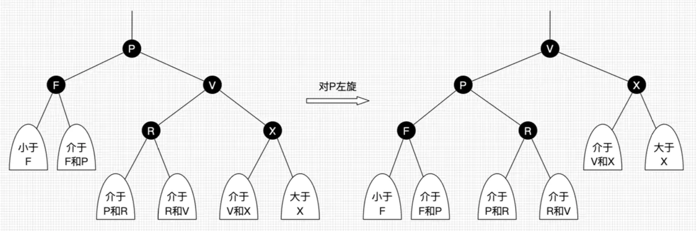

# 基础知识

基本从学习java的第二天就会接触容器的概念，包括List、Vector（JDK1.5后基本不再用了）、ArrayList、HashMap等等。有了容器，在日常开发中能很容易把业务逻辑融合到容器中，能替代数组的大部分操作。
 谈到数组，估计很多人第一印象是多维数组循环是多么的复杂，我当时学C时，二维数组就基本把人搞晕了，不过到Java里面，因为容器的存在，数组一般不会用到，多数都用容器替代，主要原因是数组初始化时需要定义数组长度，而容器则不需要，基本是可变长度。定义一个可变长度的数组还是比较麻烦的。

下图中，其中淡绿色的表示接口，红色的表示我们经常使用的类。


## Collection

　Collection是最基本的集合接口，一个Collection代表一组Object，即Collection的元素（Elements）。一些Collection允许相同的元素而另一些不行。一些能排序而另一些不行。Java SDK不提供直接继承自Collection的类，Java SDK提供的类都是继承自Collection的“子接口”如List和Set。　　

```java
主要方法:
boolean add(Object o)添加对象到集合
boolean remove(Object o)删除指定的对象
int size()返回当前集合中元素的数量
boolean contains(Object o)查找集合中是否有指定的对象
boolean isEmpty()判断集合是否为空
Iterator iterator()返回一个迭代器
boolean containsAll(Collection c)查找集合中是否有集合c中的元素
boolean addAll(Collection c)将集合c中所有的元素添加给该集合
void clear()删除集合中所有元素
void removeAll(Collection c)从集合中删除c集合中也有的元素
void retainAll(Collection c)从集合中删除集合c中不包含的元素
```

### List

List是有序的Collection，使用此接口能够精确的控制每个元素插入的位置。用户能够使用索引（元素在List中的位置，类似于数组下标）来访问List中的元素，这类似于Java的数组。实现List接口的常用类有LinkedList，ArrayList，Vector和Stack。

#### LinkedList类

LinkedList实现了List接口，允许null元素。此外LinkedList提供额外的get，remove，insert方法在 LinkedList的首部或尾部。这些操作使LinkedList可被用作堆栈（stack），队列（queue）或双向队列（deque）。

注意:LinkedList没有同步方法。如果多个线程同时访问一个List，则必须自己实现访问同步。一种解决方法是在创建List时构造一个同步的List：List list = Collections.synchronizedList(new LinkedList(…));

#### ArrayList类

ArrayList实现了可变大小的数组。它允许所有元素，包括null。ArrayList没有同步。size，isEmpty，get，set方法运行时间为常数。但是add方法开销为分摊的常数，添加n个元素需要O(n)的时间。其他的方法运行时间为线性。每个ArrayList实例都有一个容量（Capacity），即用于存储元素的数组的大小。这个容量可随着不断添加新元素而自动增加，但是增长算法并 没有定义。当需要插入大量元素时，在插入前可以调用ensureCapacity方法来增加ArrayList的容量以提高插入效率。

和LinkedList一样，ArrayList也是非同步的（unsynchronized）。一般情况下使用这两个就可以了，因为非同步，所以效率比较高。
如果涉及到堆栈，队列等操作，应该考虑用List，对于需要快速插入，删除元素，应该使用LinkedList，如果需要快速随机访问元素，应该使用ArrayList。

#### Vector类

　　Vector非常类似ArrayList，但是Vector是同步的。由Vector创建的Iterator，虽然和ArrayList创建的 Iterator是同一接口，但是，因为Vector是同步的，当一个 Iterator被创建而且正在被使用，另一个线程改变了Vector的状态（例 如，添加或删除了一些元素），这时调用Iterator的方法时将抛出 ConcurrentModificationException，因此必须捕获该 异常。

#### Stack 类

　　Stack继承自Vector，实现一个后进先出的堆栈。Stack提供5个额外的方法使得Vector得以被当作堆栈使用。基本的push和pop方 法，还有 peek方法得到栈顶的元素，empty方法测试堆栈是否为空，search方法检测一个元素在堆栈中的位置。Stack刚创建后是空栈。

### Set

Set是一种不包含重复的元素的Collection，即任意的两个元素e1和e2都有e1.equals(e2)=false，Set最多有一个null元素。 Set的构造函数有一个约束条件，传入的Collection参数不能包含重复的元素。
Set容器类主要有HashSet和TreeSet等。

#### HashSet类

Java.util.HashSet类实现了Java.util.Set接口。

- 它不允许出现重复元素；
- 不保证和政集合中元素的顺序
- 允许包含值为null的元素，但最多只能有一个null元素。

```java
public class TestHashSet
{
    public static void main(String [] args)
    {
       HashSet h=new HashSet();
       h.add("1st");
       h.add("2nd");
       h.add(new Integer(3));
       h.add(new Double(4.0));
       h.add("2nd");            //重复元素，未被添加
       h.add(new Integer(3));      //重复元素，未被添加
       h.add(new Date());
       System.out.println("开始：size="+h.size());
       Iterator it=h.iterator();
       while(it.hasNext())
       {
           Object o=it.next();
           System.out.println(o);
       }
       h.remove("2nd");
       System.out.println("移除元素后：size="+h.size());
       System.out.println(h);
    }
}
```

#### TreeSet

TreeSet描述的是Set的一种变体——可以实现排序等功能的集合，它在讲对象元素添加到集合中时会自动按照某种比较规则将其插入到有序的对象序列中，并保证该集合元素组成的读uixiangxulie时刻按照“升序”排列。

```java
public class TestTreeSet
{
    public static void main(String [] args)
    {
       TreeSet ts=new TreeSet();
       ts.add("orange");
       ts.add("apple");
       ts.add("banana");
       ts.add("grape");

       Iterator it=ts.iterator();
       while(it.hasNext())
       {
           String fruit=(String)it.next();
           System.out.println(fruit);
       }
    }
}
```

## Map

Map没有继承Collection接口，Map提供key到value的映射。一个Map中不能包含相同的key，每个key只能映射一个 value。Map接口提供3种集合的视图，Map的内容可以被当作一组key集合，一组value集合，或者一组key-value映射。

```java
主要方法:
boolean equals(Object o)比较对象
boolean remove(Object o)删除一个对象
put(Object key,Object value)添加key和value
Hashtable类
```

### Hashtable类

Hashtable继承Map接口，实现一个key-value映射的哈希表。任何非空（non-null）的对象都可作为key或者value。**添加数据使用put(key, value)，取出数据使用get(key)，这两个基本操作的时间开销为常数。**Hashtable通过initial capacity和load factor两个参数调整性能。通常缺省的load factor 0.75较好地实现了时间和空间的均衡。增大load factor可以节省空间但相应的查找时间将增大，这会影响像get和put这样的操作。

由于作为key的对象将通过计算其散列函数来确定与之对应的value的位置，因此任何作为key的对象都必须实现hashCode和equals方法。hashCode和equals方法继承自根类Object，如果你用自定义的类当作key的话，要相当小心，按照散列函数的定义，如果两个对象相同，即obj1.equals(obj2)=true，则它们的hashCode必须相同，但如果两个对象不同，则它们的hashCode不一定不同，如果两个不同对象的hashCode相同，这种现象称为冲突，冲突会导致操作哈希表的时间开销增大，所以尽量定义好的hashCode()方法，能加快哈希表的操作。

如果相同的对象有不同的hashCode，对哈希表的操作会出现意想不到的结果（期待的get方法返回null），要避免这种问题，只需要牢记一条：要同时复写equals方法和hashCode方法，而不要只写其中一个。

### HashMap类

HashMap和Hashtable类似，不同之处在于HashMap是非同步的，并且允许null，即null value和null key，但是将HashMap视为Collection时（values()方法可返回Collection），其迭代子操作时间开销和HashMap的容量成比例。因此，如果迭代操作的性能相当重要的话，不要将HashMap的初始化容量设得过高，或者load factor过低。　　

－JDK1.0引入了第一个关联的集合类HashTable，它是线程安全的。 HashTable的所有方法都是同步的。
－JDK2.0引入了HashMap，它提供了一个不同步的基类和一个同步的包装器synchronizedMap。synchronizedMap被称为 有条件的线程安全类。
－JDK5.0util.concurrent包中引入对Map线程安全的实现ConcurrentHashMap，比起synchronizedMap， 它提供了更高的灵活性。同时进行的读和写操作都可以并发地

### HashTable和HashMap区别

第一、继承不同。
　　public class Hashtable extends Dictionary implements Map
　　public class HashMap  extends AbstractMap implements Map
第二、Hashtable 中的方法是同步的，而HashMap中的方法在缺省情况下是非同步的。在多线程并发的环境下，可以直接使用Hashtable，但是要使用HashMap的话就要自己增加同步处理了。
第三、Hashtable中，key和value都不允许出现null值。在HashMap中，null可以作为键，这样的键只有一个；可以有一个或多个键所对应的值为null。当get()方法返回null值时，即可以表示 HashMap中没有该键，也可以表示该键所对应的值为null。因此，在HashMap中不能由get()方法来判断HashMap中是否存在某个键， 而应该用containsKey()方法来判断。
第四、两个遍历方式的内部实现上不同。Hashtable、HashMap都使用了 Iterator。而由于历史原因，Hashtable还使用了Enumeration的方式 。
第五、哈希值的使用不同，HashTable直接使用对象的hashCode。而HashMap重新计算hash值。
第六、Hashtable和HashMap它们两个内部实现方式的数组的初始大小和扩容的方式。HashTable中hash数组默认大小是11，增加的方式是 old*2+1。HashMap中hash数组的默认大小是16，而且一定是2的指数。

### WeakHashMap类

　　WeakHashMap是一种改进的HashMap，它对key实行“弱引用”，如果一个key不再被外部所引用，那么该key可以被GC回收。

> 参考

[你必须知道的几种java容器（集合类）_晚秋星辰-CSDN博客](https://blog.csdn.net/dengpeng0419/article/details/47983033)

# 面试问题

## HashMap的底层结构

[Java中HashMap底层实现原理(JDK1.8)源码分析_tuke_tuke的博客-CSDN博客_hashmap底层](https://blog.csdn.net/tuke_tuke/article/details/51588156)

在JDK1.6，JDK1.7中，HashMap采用位桶+链表实现，即使用链表处理冲突，同一hash值的链表都存储在一个链表里。但是当位于一个桶中的元素较多，即hash值相等的元素较多时，通过key值依次查找的效率较低。而JDK1.8中，HashMap采用位桶+链表+红黑树实现，当链表长度超过阈值（8）时，将链表转换为红黑树，这样大大减少了查找时间。

首先有一个每个元素都是链表（可能表述不准确）的数组，当添加一个元素（key-value）时，就首先计算元素key的hash值，以此确定插入数组中的位置，但是可能存在同一hash值的元素已经被放在数组同一位置了，这时就添加到同一hash值的元素的后面，他们在数组的同一位置，但是形成了链表，同一各链表上的Hash值是相同的，所以说数组存放的是链表。而当链表长度太长时，链表就转换为红黑树，这样大大提高了查找的效率。

当链表数组的容量超过初始容量的0.75时，再散列将链表数组扩大2倍，把原链表数组的搬移到新的数组中

即HashMap的原理图是：


### 加载因子

加载因子（默认0.75）：为什么需要使用加载因子，为什么需要扩容呢？因为如果填充比很大，说明利用的空间很多，如果一直不进行扩容的话，链表就会越来越长，这样查找的效率很低，因为链表的长度很大（当然最新版本使用了红黑树后会改进很多），扩容之后，将原来链表数组的每一个链表分成奇偶两个子链表分别挂在新链表数组的散列位置，这样就减少了每个链表的长度，增加查找效率

HashMap本来是以空间换时间，所以填充比没必要太大。但是填充比太小又会导致空间浪费。如果关注内存，填充比可以稍大，如果主要关注查找性能，填充比可以稍小。

### HasMap的扩容机制resize()

构造hash表时，如果不指明初始大小，默认大小为16（即Node数组大小16），如果Node[]数组中的元素达到（填充比\*Node.length）重新调整HashMap大小 变为原来2倍大小,扩容很耗时

### 红黑树改进

在java jdk8中对HashMap的源码进行了优化，在jdk7中，HashMap处理“碰撞”的时候，都是采用链表来存储，当碰撞的结点很多时，查询时间是O（n）。
在jdk8中，HashMap处理“碰撞”增加了红黑树这种数据结构，当碰撞结点较少时，采用链表存储，当较大时（>8个），采用红黑树（特点是查询时间是O（logn））存储（有一个阀值控制，大于阀值(8个)，将链表存储转换成红黑树存储）

你可能还知道哈希碰撞会对hashMap的性能带来灾难性的影响。如果多个hashCode()的值落到同一个桶内的时候，这些值是存储到一个链表中的。最坏的情况下，所有的key都映射到同一个桶中，这样hashmap就退化成了一个链表——查找时间从O(1)到O(n)。

 如果某个桶中的记录过大的话（当前是TREEIFY_THRESHOLD = 8），HashMap会动态的使用一个专门的treemap实现来替换掉它。这样做的结果会更好，是O(logn)，而不是糟糕的O(n)。

> 它是如何工作的？前面产生冲突的那些KEY对应的记录只是简单的追加到一个链表后面，这些记录只能通过遍历来进行查找。但是超过这个阈值后HashMap开始将列表升级成一个二叉树，使用哈希值作为树的分支变量，如果两个哈希值不等，但指向同一个桶的话，较大的那个会插入到右子树里。如果哈希值相等，HashMap希望key值最好是实现了Comparable接口的，这样它可以按照顺序来进行插入。这对HashMap的key来说并不是必须的，不过如果实现了当然最好。如果没有实现这个接口，在出现严重的哈希碰撞的时候，你就并别指望能获得性能提升了。

## 红黑树是啥

[30张图带你彻底理解红黑树 - 简书 (jianshu.com)](https://www.jianshu.com/p/e136ec79235c)

[红黑树（RB-tree）比AVL树的优势在哪？_mmshixing的博客-CSDN博客_红黑树优点](https://blog.csdn.net/mmshixing/article/details/51692892)

### 定义和基本性质

红黑树是一种含有红黑结点并能自平衡的二叉查找树。它必须满足下面性质：

- 性质1：每个节点要么是黑色，要么是红色。
- 性质2：根节点是黑色。
- 性质3：每个叶子节点（NIL）是黑色。
- 性质4：每个红色结点的两个子结点一定都是黑色。
- **性质5：任意一结点到每个叶子结点的路径都包含数量相同的黑结点。**

从性质5又可以推出：

- 性质5.1：如果一个结点存在黑子结点，那么该结点肯定有两个子结点

下图就是一颗简单的红黑树。其中Nil为叶子结点(**2020/01/16补充：图中的红色结点H和M同样存在叶子子结点，后文的图类似，不再阐明。感谢评论区的同学提醒，带来误解抱歉。**)，并且它是黑色的。(值得提醒注意的是，在Java中，叶子结点是为null的结点。)


红黑树并不是一个*完美*平衡二叉查找树，从图1可以看到，根结点P的左子树显然比右子树高，但左子树和右子树的黑结点的层数是相等的，也即任意一个结点到到每个叶子结点的路径都包含数量相同的黑结点(性质5)。所以我们叫红黑树这种平衡为**黑色完美平衡**。

红黑树一些结点的叫法


前面讲到红黑树能自平衡，它靠的是什么？三种操作：左旋、右旋和变色。

- **左旋**：以某个结点作为支点(旋转结点)，其右子结点变为旋转结点的父结点，右子结点的左子结点变为旋转结点的右子结点，左子结点保持不变。如图3。
- **右旋**：以某个结点作为支点(旋转结点)，其左子结点变为旋转结点的父结点，左子结点的右子结点变为旋转结点的左子结点，右子结点保持不变。如图4。
- **变色**：结点的颜色由红变黑或由黑变红。




我们先忽略颜色，可以看到旋转操作不会影响旋转结点的父结点，父结点以上的结构还是保持不变的。
 **左旋**只影响旋转结点和其**右子树**的结构，把右子树的结点往左子树挪了。
 **右旋**只影响旋转结点和其**左子树**的结构，把左子树的结点往右子树挪了。

所以旋转操作是**局部**的。另外可以看出旋转能保持红黑树平衡的一些端详了：当一边子树的结点少了，那么向另外一边子树“借”一些结点；当一边子树的结点多了，那么向另外一边子树“租”一些结点。

但要保持红黑树的性质，结点不能乱挪，还得靠变色了。怎么变？具体情景有不同变法，后面会具体讲到，现在只需要记住**红黑树总是通过旋转和变色达到自平衡**。

### 红黑树如何查找

我们先忽略颜色，可以看到旋转操作不会影响旋转结点的父结点，父结点以上的结构还是保持不变的。
 **左旋**只影响旋转结点和其**右子树**的结构，把右子树的结点往左子树挪了。
 **右旋**只影响旋转结点和其**左子树**的结构，把左子树的结点往右子树挪了。

所以旋转操作是**局部**的。另外可以看出旋转能保持红黑树平衡的一些端详了：当一边子树的结点少了，那么向另外一边子树“借”一些结点；当一边子树的结点多了，那么向另外一边子树“租”一些结点。

但要保持红黑树的性质，结点不能乱挪，还得靠变色了。怎么变？具体情景又不同变法，后面会具体讲到，现在只需要记住**红黑树总是通过旋转和变色达到自平衡**。


非常简单，但简单不代表它效率不好。正由于红黑树总保持黑色完美平衡，所以它的查找最坏时间复杂度为O(2lgN)，也即整颗树刚好红黑相隔的时候。能有这么好的查找效率得益于红黑树自平衡的特性，而这背后的付出，红黑树的插入操作功不可没～


红黑树并不追求“完全平衡”——它只要求部分地达到平衡要求，降低了对旋转的要求，从而提高了性能。

红黑树能够以O(log2 n) 的时间复杂度进行搜索、插入、删除操作。此外，由于它的设计，任何不平衡都会在三次旋转之内解决。当然，还有一些更好的，但实现起来更复杂的数据结构 能够做到一步旋转之内达到平衡，但红黑树能够给我们一个比较“便宜”的解决方案。红黑树的算法时间复杂度和AVL相同，但统计性能比AVL树更高。

当然，红黑树并不适应所有应用树的领域。如果数据基本上是静态的，那么让他们待在他们能够插入，并且不影响平衡的地方会具有更好的性能。如果数据完全是静态的，例如，做一个哈希表，性能可能会更好一些。

在实际的系统中，例如，需要使用动态规则的防火墙系统，使用红黑树而不是散列表被实践证明具有更好的伸缩性。

