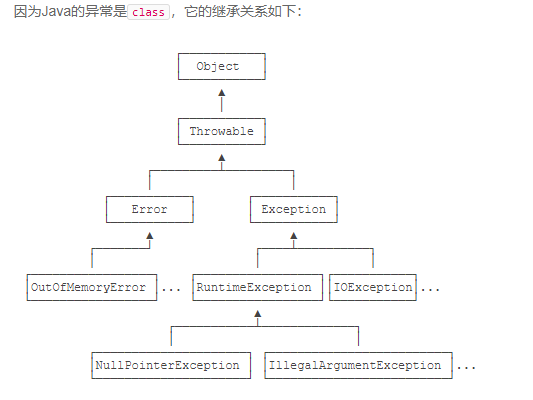
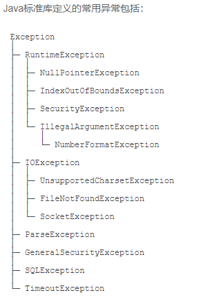
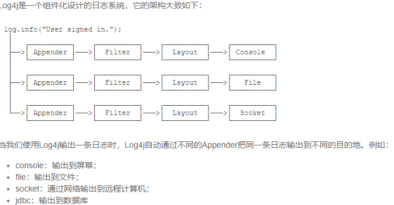

# Java的异常

方法一：约定返回错误码。

例如，处理一个文件，如果返回`0`，表示成功，返回其他整数，表示约定的错误码：

```java
int code = processFile("C:\\test.txt");
if (code == 0) {
    // ok:
} else {
    // error:
    switch (code) {
    case 1:
        // file not found:
    case 2:
        // no read permission:
    default:
        // unknown error:
    }
}
```

方法二：在语言层面上提供一个异常处理机制。

Java内置了一套异常处理机制，总是使用异常来表示错误。

异常是一种`class`，因此它本身带有类型信息。异常可以在任何地方抛出，但只需要在上层捕获，这样就和方法调用分离了：

```java
try {
    String s = processFile(“C:\\test.txt”);
    // ok:
} catch (FileNotFoundException e) {
    // file not found:
} catch (SecurityException e) {
    // no read permission:
} catch (IOException e) {
    // io error:
} catch (Exception e) {
    // other error:
}
```



继承关系可知：`Throwable`是异常体系的根，它继承自`Object`。`Throwable`有两个体系：`Error`和`Exception`，`Error`表示严重的错误，程序对此一般无能为力，例如：

- `OutOfMemoryError`：内存耗尽
- `NoClassDefFoundError`：无法加载某个Class
- `StackOverflowError`：栈溢出

而`Exception`则是运行时的错误，它可以被捕获并处理。

某些异常是应用程序逻辑处理的一部分，应该捕获并处理。例如：

- `NumberFormatException`：数值类型的格式错误
- `FileNotFoundException`：未找到文件
- `SocketException`：读取网络失败

还有一些异常是程序逻辑编写不对造成的，应该修复程序本身。例如：

- `NullPointerException`：对某个`null`的对象调用方法或字段
- `IndexOutOfBoundsException`：数组索引越界

`Exception`又分为两大类：

1. `RuntimeException`以及它的子类；
2. 非`RuntimeException`（包括`IOException`、`ReflectiveOperationException`等等）

Java规定：

- 必须捕获的异常，包括`Exception`及其子类，但不包括`RuntimeException`及其子类，这种类型的异常称为Checked Exception。
- 不需要捕获的异常，包括`Error`及其子类，`RuntimeException`及其子类。

捕获后不处理的方式是非常不好的，即使真的什么也做不了，也要先把异常记录下来：

```java
static byte[] toGBK(String s) {
    try {
        return s.getBytes("GBK");
    } catch (UnsupportedEncodingException e) {
        // 先记下来再说:
        e.printStackTrace();
    }
    return null;
```

所有异常都可以调用`printStackTrace()`方法打印异常栈，这是一个简单有用的快速打印异常的方法。

## 小结

Java使用异常来表示错误，并通过`try ... catch`捕获异常；

Java的异常是`class`，并且从`Throwable`继承；

`Error`是无需捕获的严重错误，`Exception`是应该捕获的可处理的错误；

`RuntimeException`无需强制捕获，非`RuntimeException`（Checked Exception）需强制捕获，或者用`throws`声明；

不推荐捕获了异常但不进行任何处理。

# 异常捕获

在Java中，凡是可能抛出异常的语句，都可以用`try ... catch`捕获。把可能发生异常的语句放在`try { ... }`中，然后使用`catch`捕获对应的`Exception`及其子类。

存在多个`catch`的时候，`catch`的顺序非常重要：子类必须写在前面。例如：

```java
public static void main(String[] args) {
    try {
        process1();
        process2();
        process3();
    } catch (IOException e) {
        System.out.println("IO error");
    } catch (UnsupportedEncodingException e) { // 永远捕获不到
        System.out.println("Bad encoding");
    }
}
```

对于上面的代码，`UnsupportedEncodingException`异常是永远捕获不到的，因为它是`IOException`的子类。当抛出`UnsupportedEncodingException`异常时，会被`catch (IOException e) { ... }`捕获并执行。因此，正确的写法是把子类放到前面：

## finally语句

无论是否有异常发生，如果我们都希望执行一些语句，例如清理工作，怎么写？

```java
public static void main(String[] args) {
    try {
        process1();
        process2();
        process3();
    } catch (UnsupportedEncodingException e) {
        System.out.println("Bad encoding");
    } catch (IOException e) {
        System.out.println("IO error");
    } finally {
        System.out.println("END");
    }
}
```

注意`finally`有几个特点：

1. `finally`语句不是必须的，可写可不写；
2. `finally`总是最后执行。

如果没有发生异常，就正常执行`try { ... }`语句块，然后执行`finally`。如果发生了异常，就中断执行`try { ... }`语句块，然后跳转执行匹配的`catch`语句块，最后执行`finally`。

可见，`finally`是用来保证一些代码必须执行的。

某些情况下，可以没有`catch`，只使用`try ... finally`结构。

处理`IOException`和`NumberFormatException`的代码是相同的，所以我们可以把它两用`|`合并到一起

```java
public static void main(String[] args) {
    try {
        process1();
        process2();
        process3();
    } catch (IOException | NumberFormatException e) { // IOException或NumberFormatException
        System.out.println("Bad input");
    } catch (Exception e) {
        System.out.println("Unknown error");
    }
}
```

# 抛出异常

## 异常的传播

当某个方法抛出了异常时，如果当前方法没有捕获异常，异常就会被抛到上层调用方法，直到遇到某个`try ... catch`被捕获为止：

```java
public class Main {
    public static void main(String[] args) {
        try {
            process1();
        } catch (Exception e) {
            e.printStackTrace();
        }
    }
    static void process1() {
        process2();
    }
    static void process2() {
        Integer.parseInt(null); // 会抛出NumberFormatException
    }
}
```

通过`printStackTrace()`可以打印出方法的调用栈，类似：

```java
java.lang.NumberFormatException: null
    at java.base/java.lang.Integer.parseInt(Integer.java:614)
    at java.base/java.lang.Integer.parseInt(Integer.java:770)
    at Main.process2(Main.java:16)
    at Main.process1(Main.java:12)
    at Main.main(Main.java:5)
```

## 抛出异常

当发生错误时，例如，用户输入了非法的字符，我们就可以抛出异常。

如何抛出异常？参考`Integer.parseInt()`方法，抛出异常分两步：

1. 创建某个`Exception`的实例；
2. 用`throw`语句抛出。

```java
void process2(String s) {
    if (s==null) {
        NullPointerException e = new NullPointerException();
        throw e;
    }
}
```

## 异常屏蔽

如果在执行`finally`语句时抛出异常，那么，`catch`语句的异常还能否继续抛出？例如

```java
public class Main {
    public static void main(String[] args) {
        try {
            Integer.parseInt("abc");
        } catch (Exception e) {
            System.out.println("catched");
            throw new RuntimeException(e);
        } finally {
            System.out.println("finally");
            throw new IllegalArgumentException();
        }
    }
}
```

执行上述代码，发现异常信息如下：

```
catched
finally
Exception in thread "main" java.lang.IllegalArgumentException
    at Main.main(Main.java:11)
```

这说明`finally`抛出异常后，原来在`catch`中准备抛出的异常就“消失”了，因为只能抛出一个异常。没有被抛出的异常称为“被屏蔽”的异常（Suppressed Exception）。

在极少数的情况下，我们需要获知所有的异常。如何保存所有的异常信息？方法是先用`origin`变量保存原始异常，然后调用`Throwable.addSuppressed()`，把原始异常添加进来，最后在`finally`抛出：

```java
public class Main {
    public static void main(String[] args) throws Exception {
        Exception origin = null;
        try {
            System.out.println(Integer.parseInt("abc"));
        } catch (Exception e) {
            origin = e;
            throw e;
        } finally {
            Exception e = new IllegalArgumentException();
            if (origin != null) {
                e.addSuppressed(origin);
            }
            throw e;
        }
    }
}
```

# 自定义异常



在一个大型项目中，可以自定义新的异常类型，但是，保持一个合理的异常继承体系是非常重要的。

一个常见的做法是自定义一个`BaseException`作为“根异常”，然后，派生出各种业务类型的异常。

`BaseException`需要从一个适合的`Exception`派生，通常建议从`RuntimeException`派生：

自定义的`BaseException`应该提供多个构造方法：

```
public class BaseException extends RuntimeException {
    public BaseException() {
        super();
    }

    public BaseException(String message, Throwable cause) {
        super(message, cause);
    }

    public BaseException(String message) {
        super(message);
    }

    public BaseException(Throwable cause) {
        super(cause);
    }
}
```

上述构造方法实际上都是原样照抄`RuntimeException`。这样，抛出异常的时候，就可以选择合适的构造方法。通过IDE可以根据父类快速生成子类的构造方法。

# 空指针异常

在所有的`RuntimeException`异常中，Java程序员最熟悉的恐怕就是`NullPointerException`了。

`NullPointerException`即空指针异常，俗称NPE。如果一个对象为`null`，调用其方法或访问其字段就会产生`NullPointerException`，这个异常通常是由JVM抛出的，例如：

```java
public class Main {
    public static void main(String[] args) {
        String s = null;
        System.out.println(s.toLowerCase());
    }
}
```

### 理NullPointerException

如果遇到`NullPointerException`，我们应该如何处理？首先，必须明确，`NullPointerException`是一种代码逻辑错误，遇到`NullPointerException`，遵循原则是早暴露，早修复，严禁使用`catch`来隐藏这种编码错误：

```
// 错误示例: 捕获NullPointerException
try {
    transferMoney(from, to, amount);
} catch (NullPointerException e) {
}
```

好的编码习惯可以极大地降低`NullPointerException`的产生，例如：

成员变量在定义时初始化：

```
public class Person {
    private String name = "";
}
```

使用空字符串`""`而不是默认的`null`可避免很多`NullPointerException`，编写业务逻辑时，用空字符串`""`表示未填写比`null`安全得多。

返回空字符串`""`、空数组而不是`null`：

```
public String[] readLinesFromFile(String file) {
    if (getFileSize(file) == 0) {
        // 返回空数组而不是null:
        return new String[0];
    }
    ...
}
```

> 参考

[NullPointerException - 廖雪峰的官方网站 (liaoxuefeng.com)](https://www.liaoxuefeng.com/wiki/1252599548343744/1337645544243233)

# 断言

断言（Assertion）是一种调试程序的方式。在Java中，使用`assert`关键字来实现断言。

我们先看一个例子：

```
public static void main(String[] args) {
    double x = Math.abs(-123.45);
    assert x >= 0;
    System.out.println(x);
}
```

语句`assert x >= 0;`即为断言，断言条件`x >= 0`预期为`true`。如果计算结果为`false`，则断言失败，抛出`AssertionError`。

使用`assert`语句时，还可以添加一个可选的断言消息：

```
assert x >= 0 : "x must >= 0";
```

这样，断言失败的时候，`AssertionError`会带上消息`x must >= 0`，更加便于调试。

Java断言的特点是：断言失败时会抛出`AssertionError`，导致程序结束退出。因此，断言不能用于可恢复的程序错误，只应该用于开发和测试阶段。

要执行`assert`语句，必须给Java虚拟机传递`-enableassertions`（可简写为`-ea`）参数启用断言。所以，上述程序必须在命令行下运行才有效果

## 小结

断言是一种调试方式，断言失败会抛出`AssertionError`，只能在开发和测试阶段启用断言；

对可恢复的错误不能使用断言，而应该抛出异常；

断言很少被使用，更好的方法是编写单元测试。

# 日志

在编写程序的过程中，发现程序运行结果与预期不符，怎么办？当然是用`System.out.println()`打印出执行过程中的某些变量，观察每一步的结果与代码逻辑是否符合，然后有针对性地修改代码。

代码改好了怎么办？当然是删除没有用的`System.out.println()`语句了。

如果改代码又改出问题怎么办？再加上`System.out.println()`。

反复这么搞几次，很快大家就发现使用`System.out.println()`非常麻烦。

怎么办？

解决方法是使用日志。

那什么是日志？日志就是Logging，它的目的是为了取代`System.out.println()`。

```java
public class Hello {
    public static void main(String[] args) {
        Logger logger = Logger.getGlobal();
        logger.info("start process...");
        logger.warning("memory is running out...");
        logger.fine("ignored.");
        logger.severe("process will be terminated...");
    }
}
```

## 小结

日志是为了替代`System.out.println()`，可以定义格式，重定向到文件等；

日志可以存档，便于追踪问题；

日志记录可以按级别分类，便于打开或关闭某些级别；

可以根据配置文件调整日志，无需修改代码；

Java标准库提供了`java.util.logging`来实现日志功能。

# Log4j

前面介绍了Commons Logging，可以作为“日志接口”来使用。而真正的“日志实现”可以使用Log4j。

Log4j是一种非常流行的日志框架，最新版本是2.x。



