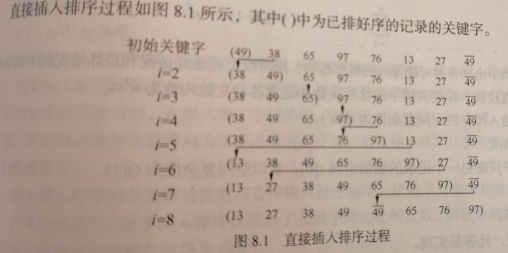
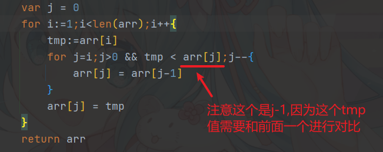
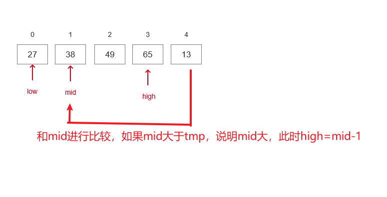
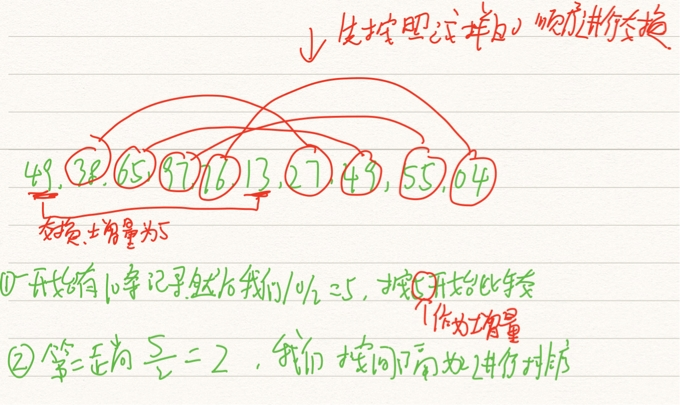
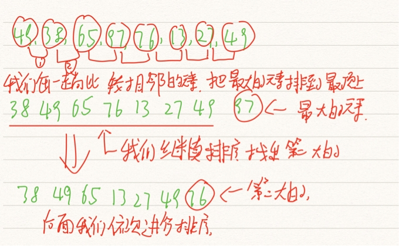

10大排序算法


# 插入排序

## 直接插入排序

插入排序是最简单的，我们不断比较插入数据

```go
// 插入排序
func insertSort(arr []int )[]int{
   var j = 0
   for i := 1; i < len(arr); i++ {
      // 定义临时变量暂存当前位置数据
      tmp := arr[i]
      // j为当前位置，我们不断把数据往后移，直到找到比tmp小或者j>0时结束
      for j = i; j > 0 && tmp < arr[j - 1]; j-- {
         // 移动时我们的数字要不断往后移
         arr[j] = arr[j - 1]
      }
      // 最后这个j就是我们空出来的，这个时候我们把tmp值放入
      arr[j] = tmp
   }
   return arr
}


// 主函数
func main()  {
   fmt.Println(insertSort([]int{38,65,97,76,13,27,49}))
}
```

插入排序的思想如下



时间复杂度为o(n^2) 空间复杂度为o(1)

我的错误代码



## 折半插入排序



```go
// 折半插入排序
func BInsertSort(arr []int) []int {
	// 变量定义
	var i,j,mid int;var low=0;var high =0;var tmp =0
	// 遍历数组
	for i = 1; i<len(arr);i++{
		// 定义折半查找变量
		low=0;high=i-1;tmp=arr[i]
		// 我们使用折半查找，来找出比刚好比tmp节点大的节点（再往前一个就小）
		for low <= high{
			// 求中值
			mid = (high+low) / 2
			// 判断中值和tmp的，如果比tmp大，我们的high就需要减小，然后再进行比较
			if arr[mid] > tmp{
				high = mid -  1
			}else{
				low = mid + 1
			}
		}
		// 最后我们可以确定这个low就是我们要插入的地方，我们把low后面的节点整体
		for j=i;j>low;j--{
			arr[j] = arr[j-1]
		}
		// 替换low节点
		arr[low] = tmp
	}
	return arr
}
```

时间复杂度为o(n^2) 时间复杂度为O(1)

## 希尔排序

也叫缩小增量排序，通过把整个待排序记录序列分割成几组，从而减少需要排序的数据量



代码运行结果


我们的代码如下：

```go
func ShellInsert(theArray []int) []int {
   // 先把排序值除半
   dValue := len(theArray) / 2
   for dValue > 0 {
      // 希尔排序的核心在于每次分组都除于2，我们这里遍历所有的数组
      for i := 0; i < len(theArray); i++{
         // j等于i，先暂存
         j := i
         // 当j刚好大于dvalue的时候我们开始进行比较交换，按照dvalue这个间隔，不断交换数据
         for (j-dValue >= 0) && (theArray[j] < theArray[j -dValue]) {
            theArray[j], theArray[j -dValue] = theArray[j -dValue], theArray[j]
            // todo 不清楚意思
            j -= dValue
         }
      }
      // dvalue值减半
      dValue /= 2
      fmt.Println(theArray, dValue)
   }
   return theArray
}
```

# 交换排序

## 冒泡排序

代码如下：

```go
// 冒泡排序
func BubbleSort(arr []int) []int {
	// m表示排序的趟数
	m:=len(arr) -1;flag:=true
	for m>0 && flag{
		// flag标记为false，标记没有排序
		flag = false
		// 下面我们按顺序进行排序
		// (因为每次排序后，最后面的一个肯定是最大的，所以我们通过m来标记最大值所在的位置)
		for j:=0;j<m;j++{
			// 如果当前位置大于后面的，我们就需要进行排序了
			if arr[j] > arr[j+1] {
				flag = true
				// 我们交换一下排序的值
				arr[j],arr[j+1] = arr[j+1],arr[j]
			}
		}
		// 这一趟我们排序完了，我们进行下一轮排序
		m--
	}
	return arr
}
```

算法思路如下



> 算法特点

(1)稳定排序。

(2)可用于链式存储结构。

(3)移动记录次数较多，算法平均时间性能比直接插入排序差。当初始记录无序，n较大时此算法不宜采用。

## 快速排序

快速排序(QuickSort) 是由冒泡排序改进而得的。在冒泡排序过程中， 只对相邻的两个记录进行比较，因此每次交换两个相邻记录时只能消除一个逆序。如果能通过两个(不相邻)记录的一次交换，消除多个逆序，则会大大加快排序的速度。快速排序方法中的一次交换可能消除多个逆序。

> 算法思想

首先找出中间值，找这个值的时候要确保左边的都比它小，右边都都比它大，然后我们再通过递归遍历每部分


> 实际代码

```go
// 返回枢纽位置并进行排序
func Partition(arr *[]int,low int,high int) int {
   // 设置临时变量
   tmp := (*arr)[low]
   // 在排序时候，如果low大于high就说明我们排序完了
   for low < high{
      // 首先我们找到一个比tmp小的值，这个需要放在low位置
      for low < high && (*arr)[high] >= tmp{high--}
      // 交换位置
      (*arr)[low] = (*arr)[high]
      // 然后我们又从开头找出比low小的，这个值和high进行交换（因为前面high已经和low交换了）
      for low < high && (*arr)[low] <= tmp{low++}
      // 交换位置
      (*arr)[high] = (*arr)[low]
   }
   // 这样我们就可以把比low小的都放左边，比low大的都放右边了
   (*arr)[low] = tmp
   // 然后我们返回low的位置
   return low
}

// 快速排序
func QuickSort(arr *[]int,low int,high int) {
   if low < high {
      // 我们把low的值作为分界线，并返回位置
      mid := Partition(arr, low, high)
      // 对左边进行排序
      QuickSort(arr, low, mid-1)
      // 对右边进行排序
      QuickSort(arr, mid+1, high)
   }
}
// 主函数
func main()  {
   arr:= []int{49,38,65,97,76,13,27,49}
   QuickSort(&arr,0,7)
   fmt.Println(arr)
}
```

> 算法特点

(1)记录非顺次的移动导致排序方法是不稳定的。

(2)排序过程中需要定位表的下界和上界，所以适合用于顺序结构，很难用于链式结构。

(3)当n较大时，在平均情况下快速排序是所有内部排序方法中速度最快的一种，所以其适合初始记录无序、n较大时的情况。

# 选择排序

## 简单选择排序