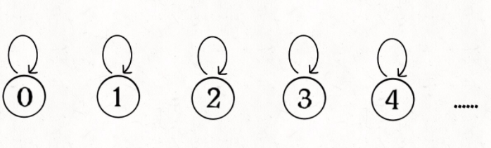
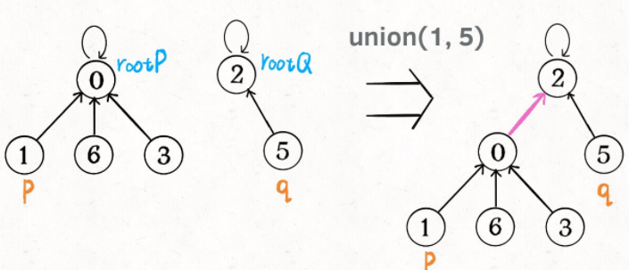
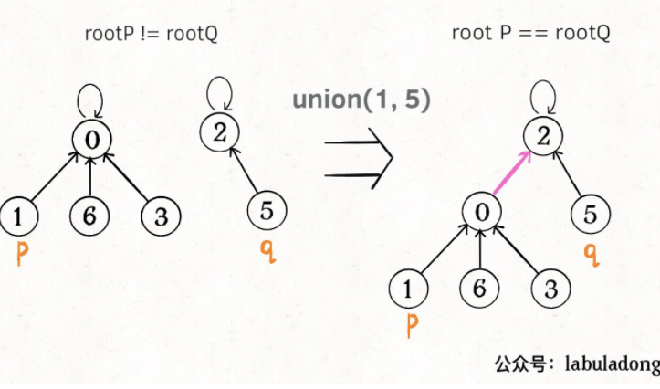
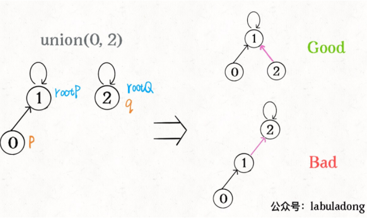
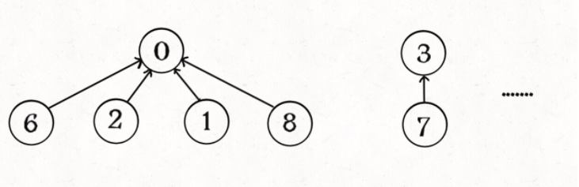
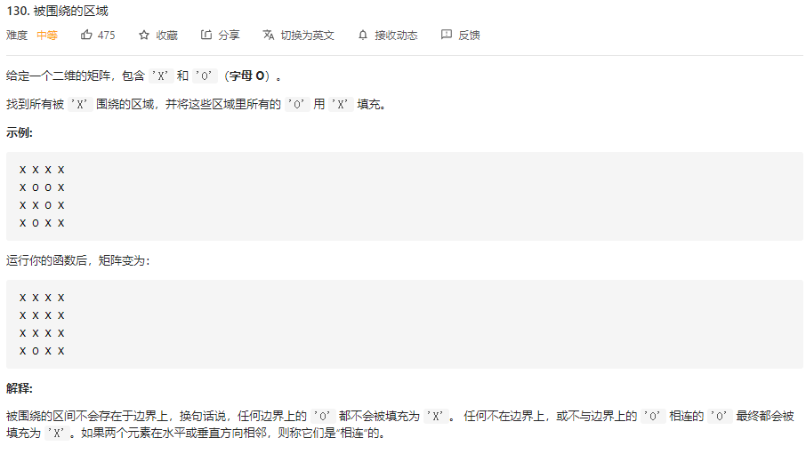
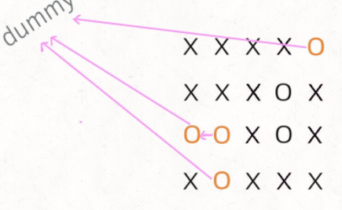
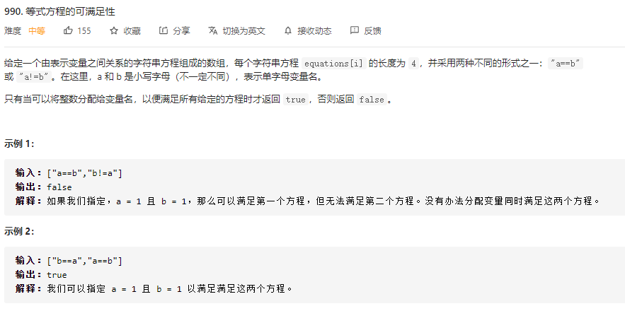
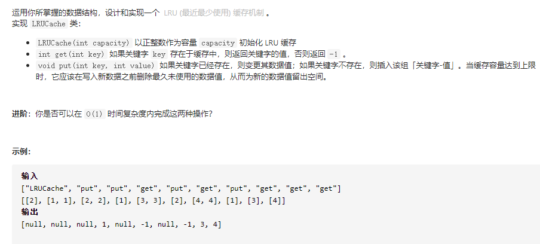
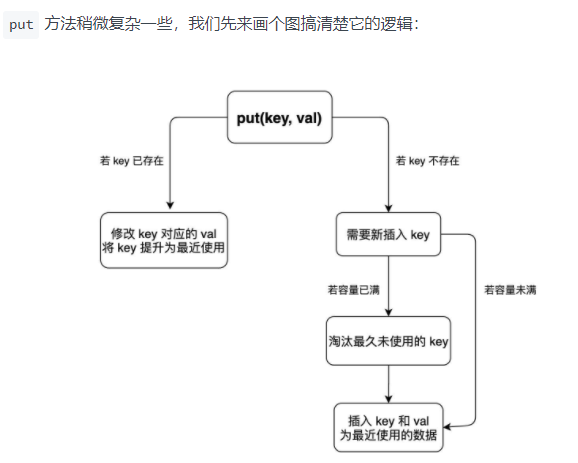

[Union-Find算法详解 - labuladong的算法小抄 (gitbook.io)](https://labuladong.gitbook.io/algo/shu-ju-jie-gou-xi-lie/shou-ba-shou-she-ji-shu-ju-jie-gou/unionfind-suan-fa-xiang-jie)

#  Union-Find 算法（并查集算法）

要实现union-find算法需要实现下面几个内容

```java
class UF {
    /* 将 p 和 q 连接 */
    public void union(int p, int q);
    /* 判断 p 和 q 是否连通 */
    public boolean connected(int p, int q);
    /* 返回图中有多少个连通分量 */
    public int count();
}
```


那么我们应该如何表示呢，我们使用森林来表示连通性，用数组来表示结构



```java
class UF {
    // 记录连通分量
    private int count;
    // 节点 x 的节点是 parent[x]
    private int[] parent;

    /* 构造函数，n 为图的节点总数 */
    public UF(int n) {
        // 一开始互不连通
        this.count = n;
        // 父节点指针初始指向自己
        parent = new int[n];
        for (int i = 0; i < n; i++)
            parent[i] = i;
    }

    /* 其他函数 */
}
```

如果某两个节点被连通，则让其中的（任意）一个节点的根节点接到另一个节点的根节点上



```java
public void union(int p, int q) {
    int rootP = find(p);
    int rootQ = find(q);
    if (rootP == rootQ)
        return;
    // 将两棵树合并为一棵
    parent[rootP] = rootQ;
    // parent[rootQ] = rootP 也一样
    count--; // 两个分量合二为一
}

/* 返回某个节点 x 的根节点 */
private int find(int x) {
    // 根节点的 parent[x] == x
    while (parent[x] != x)
        x = parent[x];
    return x;
}

/* 返回当前的连通分量个数 */
public int count() { 
    return count;
}
```

**这样，如果节点`p`和`q`连通的话，它们一定拥有相同的根节点**：



链接的算法如下：

```java
public boolean connected(int p, int q) {
    int rootP = find(p);
    int rootQ = find(q);
    return rootP == rootQ;
}
```

## 平衡优化

这样的虽然很方便但是树会出现不平衡的现象，关键部分在于union这个过程

```java
public void union(int p, int q) {
    int rootP = find(p);
    int rootQ = find(q);
    if (rootP == rootQ)
        return;
    // 将两棵树合并为一棵
    parent[rootP] = rootQ;
    // parent[rootQ] = rootP 也可以
    count--;
```

我们一开始就是简单粗暴的把`p`所在的树接到`q`所在的树的根节点下面，那么这里就可能出现「头重脚轻」的不平衡状况，比如下面这种局面：



长此以往，树可能生长得很不平衡。**我们其实是希望，小一些的树接到大一些的树下面，这样就能避免头重脚轻，更平衡一些**。解决方法是额外使用一个`size`数组，记录每棵树包含的节点数，我们不妨称为「重量」：

```java
class UF {
    private int count;
    private int[] parent;
    // 新增一个数组记录树的“重量”
    private int[] size;

    public UF(int n) {
        this.count = n;
        parent = new int[n];
        // 最初每棵树只有一个节点
        // 重量应该初始化 1
        size = new int[n];
        for (int i = 0; i < n; i++) {
            parent[i] = i;
            size[i] = 1;
        }
    }
    /* 其他函数 */
}
```

比如说`size[3] = 5`表示，以节点`3`为根的那棵树，总共有`5`个节点。这样我们可以修改一下`union`方法：

```java
public void union(int p, int q) {
    int rootP = find(p);
    int rootQ = find(q);
    if (rootP == rootQ)
        return;

    // 小树接到大树下面，较平衡
    if (size[rootP] > size[rootQ]) {
        parent[rootQ] = rootP;
        size[rootP] += size[rootQ];
    } else {
        parent[rootP] = rootQ;
        size[rootQ] += size[rootP];
    }
    count--;
}
```

这样，通过比较树的重量，就可以保证树的生长相对平衡，树的高度大致在`logN`这个数量级，极大提升执行效率。

此时，`find`,`union`,`connected`的时间复杂度都下降为 O(logN)，即便数据规模上亿，所需时间也非常少。

那么我们还可以继续优化吗，我们可以进行路径压缩

## 路径压缩

这步优化特别简单，所以非常巧妙。我们能不能进一步压缩每棵树的高度，使树高始终保持为常数？



这样`find`就能以 O(1) 的时间找到某一节点的根节点，相应的，`connected`和`union`复杂度都下降为 O(1)。

要做到这一点，非常简单，只需要在`find`中加一行代码：

```java
private int find(int x) {
    while (parent[x] != x) {
        // 进行路径压缩
        parent[x] = parent[parent[x]];
        x = parent[x];
    }
    return x;
}
```

这个操作有点匪夷所思，看个 GIF 就明白它的作用了（为清晰起见，这棵树比较极端）：


可见，调用`find`函数每次向树根遍历的同时，顺手将树高缩短了，最终所有树高都不会超过 3（`union`的时候树高可能达到 3）。

PS：读者可能会问，这个 GIF 图的find过程完成之后，树高恰好等于 3 了，但是如果更高的树，压缩后高度依然会大于 3 呀？不能这么想。这个 GIF 的情景是我编出来方便大家理解路径压缩的，但是实际中，每次find都会进行路径压缩，所以树本来就不可能增长到这么高，你的这种担心应该是多余的。

完整代码如下：

```java
class UF {
    // 连通分量个数
    private int count;
    // 存储一棵树
    private int[] parent;
    // 记录树的“重量”
    private int[] size;

    public UF(int n) {
        this.count = n;
        parent = new int[n];
        size = new int[n];
        for (int i = 0; i < n; i++) {
            parent[i] = i;
            size[i] = 1;
        }
    }

    public void union(int p, int q) {
        int rootP = find(p);
        int rootQ = find(q);
        if (rootP == rootQ)
            return;

        // 小树接到大树下面，较平衡
        if (size[rootP] > size[rootQ]) {
            parent[rootQ] = rootP;
            size[rootP] += size[rootQ];
        } else {
            parent[rootP] = rootQ;
            size[rootQ] += size[rootP];
        }
        count--;
    }

    public boolean connected(int p, int q) {
        int rootP = find(p);
        int rootQ = find(q);
        return rootP == rootQ;
    }

    private int find(int x) {
        while (parent[x] != x) {
            // 进行路径压缩
            parent[x] = parent[parent[x]];
            x = parent[x];
        }
        return x;
    }

    public int count() {
        return count;
    }
}
```

算法有下面这几个关键点

1、用 `parent` 数组记录每个节点的父节点，相当于指向父节点的指针，所以 `parent` 数组内实际存储着一个森林（若干棵多叉树）。

2、用 `size` 数组记录着每棵树的重量，目的是让 `union` 后树依然拥有平衡性，而不会退化成链表，影响操作效率。

3、在 `find` 函数中进行路径压缩，保证任意树的高度保持在常数，使得 `union` 和 `connected` API 时间复杂度为 O(1)。

## 实际应用

### 替代DFS

题目[130. 被围绕的区域 - 力扣（LeetCode） (leetcode-cn.com)](https://leetcode-cn.com/problems/surrounded-regions/)



解决这个问题的传统方法也不困难，先用 for 循环遍历棋盘的**四边**，用 DFS 算法把那些与边界相连的 `O` 换成一个特殊字符，比如 `#`；然后再遍历整个棋盘，把剩下的 `O` 换成 `X`，把 `#` 恢复成 `O`。这样就能完成题目的要求，时间复杂度 O(MN)。

这个问题也可以用 Union-Find 算法解决，虽然实现复杂一些，甚至效率也略低，但这是使用 Union-Find 算法的通用思想，值得一学。

**你可以把那些不需要被替换的** **`O`** **看成一个拥有独门绝技的门派，它们有一个共同祖师爷叫** **`dummy`****，这些** **`O`** **和** **`dummy`** **互相连通，而那些需要被替换的** **`O`** **与** **`dummy`** **不连通**。



首先要解决的是，根据我们的实现，Union-Find 底层用的是一维数组，构造函数需要传入这个数组的大小，而题目给的是一个二维棋盘。

这个很简单，二维坐标 `(x,y)` 可以转换成 `x * n + y` 这个数（`m` 是棋盘的行数，`n` 是棋盘的列数）。敲黑板，**这是将二维坐标映射到一维的常用技巧**。

其次，我们之前描述的「祖师爷」是虚构的，需要给他老人家留个位置。索引 `[0.. m*n-1]` 都是棋盘内坐标的一维映射，那就让这个虚拟的 `dummy` 节点占据索引 `m * n` 好了。

```java
class Solution {
    void solve(char[][] board) {
        if (board.length == 0) return;

        int m = board.length;
        int n = board[0].length;
        // 给 dummy 留一个额外位置
        UF uf = new UF(m * n + 1);
        int dummy = m * n;
        // 将首列和末列的 O 与 dummy 连通
        for (int i = 0; i < m; i++) {
            if (board[i][0] == 'O')
                uf.union(i * n, dummy);
            if (board[i][n - 1] == 'O')
                uf.union(i * n + n - 1, dummy);
        }
        // 将首行和末行的 O 与 dummy 连通
        for (int j = 0; j < n; j++) {
            if (board[0][j] == 'O')
                uf.union(j, dummy);
            if (board[m - 1][j] == 'O')
                uf.union(n * (m - 1) + j, dummy);
        }
        // 方向数组 d 是上下左右搜索的常用手法
        int[][] d = new int[][]{{1,0}, {0,1}, {0,-1}, {-1,0}};
        for (int i = 1; i < m - 1; i++) 
            for (int j = 1; j < n - 1; j++) 
                if (board[i][j] == 'O')
                    // 将此 O 与上下左右的 O 连通
                    for (int k = 0; k < 4; k++) {
                        int x = i + d[k][0];
                        int y = j + d[k][1];
                        if (board[x][y] == 'O')
                            uf.union(x * n + y, i * n + j);
                    }
        // 所有不和 dummy 连通的 O，都要被替换
        for (int i = 1; i < m - 1; i++) 
            for (int j = 1; j < n - 1; j++) 
                if (!uf.connected(dummy, i * n + j))
                    board[i][j] = 'X';
    }
}

class UF {
    // 记录连通分量个数
    private int count;
    // 存储若干棵树
    private int[] parent;
    // 记录树的“重量”
    private int[] size;

    public UF(int n) {
        this.count = n;
        parent = new int[n];
        size = new int[n];
        for (int i = 0; i < n; i++) {
            parent[i] = i;
            size[i] = 1;
        }
    }

    /* 将 p 和 q 连通 */
    public void union(int p, int q) {
        int rootP = find(p);
        int rootQ = find(q);
        if (rootP == rootQ)
       		return;

        // 小树接到大树下面，较平衡
        if (size[rootP] > size[rootQ]) {
            parent[rootQ] = rootP;
            size[rootP] += size[rootQ];
        } else {
            parent[rootP] = rootQ;
            size[rootQ] += size[rootP];
        }
        count--;
    }

    /* 判断 p 和 q 是否互相连通 */
    public boolean connected(int p, int q) {
        int rootP = find(p);
        int rootQ = find(q);
        // 处于同一棵树上的节点，相互连通
        return rootP == rootQ;
    }

    /* 返回节点 x 的根节点 */
    private int find(int x) {
        while (parent[x] != x) {
            // 进行路径压缩
            parent[x] = parent[parent[x]];
            x = parent[x];
        }
        return x;
    }

    public int count() {
        return count;
    }
}
```

### 等式方程

[990. 等式方程的可满足性 - 力扣（LeetCode） (leetcode-cn.com)](https://leetcode-cn.com/problems/satisfiability-of-equality-equations/)



提示：

1 <= equations.length <= 500
equations[i].length == 4
equations[i][0] 和 equations[i][3] 是小写字母
equations[i][1] 要么是 '='，要么是 '!'
equations[i][2] 是 '='

我们前文说过，动态连通性其实就是一种等价关系，具有「自反性」「传递性」和「对称性」，其实 `==` 关系也是一种等价关系，具有这些性质。所以这个问题用 Union-Find 算法就很自然。

核心思想是，**将** **`equations`** **中的算式根据** **`==`** **和** **`!=`** **分成两部分，先处理** **`==`** **算式，使得他们通过相等关系各自勾结成门派；然后处理** **`!=`** **算式，检查不等关系是否破坏了相等关系的连通性**。

```java
class Solution {
    boolean equationsPossible(String[] equations) {
        // 26 个英文字母
        UF uf = new UF(26);
        // 先让相等的字母形成连通分量
        for (String eq : equations) {
            if (eq.charAt(1) == '=') {
                char x = eq.charAt(0);
                char y = eq.charAt(3);
                uf.union(x - 'a', y - 'a');
            }
        }
        // 检查不等关系是否打破相等关系的连通性
        for (String eq : equations) {
            if (eq.charAt(1) == '!') {
                char x = eq.charAt(0);
                char y = eq.charAt(3);
                // 如果相等关系成立，就是逻辑冲突
                if (uf.connected(x - 'a', y - 'a'))
                    return false;
            }
        }
        return true;
    }
}
class UF {
    // 记录连通分量个数
    private int count;
    // 存储若干棵树
    private int[] parent;
    // 记录树的“重量”
    private int[] size;

    public UF(int n) {
        this.count = n;
        parent = new int[n];
        size = new int[n];
        for (int i = 0; i < n; i++) {
            parent[i] = i;
            size[i] = 1;
        }
    }

    /* 将 p 和 q 连通 */
    public void union(int p, int q) {
        int rootP = find(p);
        int rootQ = find(q);
        if (rootP == rootQ)
            return;

        // 小树接到大树下面，较平衡
        if (size[rootP] > size[rootQ]) {
            parent[rootQ] = rootP;
            size[rootP] += size[rootQ];
        } else {
            parent[rootP] = rootQ;
            size[rootQ] += size[rootP];
        }
        count--;
    }

    /* 判断 p 和 q 是否互相连通 */
    public boolean connected(int p, int q) {
        int rootP = find(p);
        int rootQ = find(q);
        // 处于同一棵树上的节点，相互连通
        return rootP == rootQ;
    }

    /* 返回节点 x 的根节点 */
    private int find(int x) {
        while (parent[x] != x) {
            // 进行路径压缩
            parent[x] = parent[parent[x]];
            x = parent[x];
        }
        return x;
    }

    public int count() {
        return count;
    }
}
```

# LRU算法

LRU 算法就是一种缓存淘汰策略，也就是说我们认为最近使用过的数据应该是是「有用的」，很久都没用过的数据应该是无用的，内存满了就优先删那些很久没用过的数据。

[146. LRU 缓存机制 - 力扣（LeetCode） (leetcode-cn.com)](https://leetcode-cn.com/problems/lru-cache/)



先说一下put的代码



使用了双向连表后的算法

```java
class LRUCache {
    int cap;
    LinkedHashMap<Integer, Integer> cache = new LinkedHashMap<>();
    public LRUCache(int capacity) { 
        this.cap = capacity;
    }

    public int get(int key) {
        if (!cache.containsKey(key)) {
            return -1;
        }
        // 将 key 变为最近使用
        makeRecently(key);
        return cache.get(key);
    }

    public void put(int key, int val) {
        if (cache.containsKey(key)) {
            // 修改 key 的值
            cache.put(key, val);
            // 将 key 变为最近使用
            makeRecently(key);
            return;
        }

        if (cache.size() >= this.cap) {
            // 链表头部就是最久未使用的 key
            int oldestKey = cache.keySet().iterator().next();
            cache.remove(oldestKey);
        }
        // 将新的 key 添加链表尾部
        cache.put(key, val);
    }

    private void makeRecently(int key) {
        int val = cache.get(key);
        // 删除 key，重新插入到队尾
        cache.remove(key);
        cache.put(key, val);
    }
}
```

我写的代码，不过有问题，目前我也不清楚到底是哪里出了问题

```go
// @Description 
// @Author 小游
// @Date 2021/02/27
package main

type LRUCache struct {
	// 设置缓存的容量
	cap int
	// 保存map数据
	cache map[int]int
	// key的顺序
	order []int
}

// 构造函数，用于初始化
func Constructor(capacity int) LRUCache {
	// 我们初始化返回数据结构
	return LRUCache{cap: capacity,cache: map[int]int{},order: []int{}}
}

// 获取数据
func (this *LRUCache) Get(key int) int {
	// 数据是否存在
	if data,ok:=this.cache[key];!ok {
		return -1
	} else {
		// 获取了数据后我们设置为最近使用
		this.makeRecently(key)
		// 返回数据
		return data
	}
}

// 放置数据
func (this *LRUCache) Put(key int, value int)  {
	// 首先需要判断数据是否存在
	if _,ok:=this.cache[key];ok{
		// 存在我们就修改一下key
		this.cache[key] = value
		// 设置为最近调用
		this.makeRecently(key)
		return
	}
	// 判断大小是否超出了
	if len(this.cache) >= this.cap {
		// 这里我们就找出那个最久没使用的
		delete(this.cache,this.order[0])
		// 更新order
		this.order = append(this.order[1:])
	}
	// 添加新的key
	this.cache[key] = value
	// 添加时记录位置
	this.order = append(this.order, key)
}

// 设置最近使用
func (this *LRUCache) makeRecently(key int)  {
	data := this.cache[key]
	// 删除key
	delete(this.cache, key)
	// 删除当前key
	for k,v:=range this.order{
		if v == key {
			// 判断一下k是否是最后一个
			if k == 0 {
				this.order = append(this.order[1:])
			} else if k == len(this.order)-1 {
				this.order = append(this.order[:k-1])
			} else  {
				this.order = append(this.order[:k-1], this.order[k+1:]...)
			}
			break
		}
	}
	// 重新放入当前值
	this.cache[key] = data
	this.order = append(this.order, key)
}
```

因为go的map是无序的，所以我这里加了一个order数组来顺序存储当前的值

# LFU算法

下面这个题目比较困难，先不管

[算法题就像搭乐高：手把手带你拆解 LFU 算法 (qq.com)](https://mp.weixin.qq.com/s?__biz=MzAxODQxMDM0Mw==&mid=2247486545&idx=1&sn=315ebfafa82c0dd3bcd9197eb270a7b6&chksm=9bd7f259aca07b4f063778509b3803993bc0d6cdaff32c076a102547b0afb82a5eea6119ed1a&scene=21#wechat_redirect)


