参考：[设计模式 - 廖雪峰的官方网站 (liaoxuefeng.com)](https://www.liaoxuefeng.com/wiki/1252599548343744/1264742167474528)

# 创建型模式

创建型模式关注点是如何创建对象，其核心思想是要把对象的创建和使用相分离，这样使得两者能相对独立地变换。创建型模式包括：

- 工厂方法：Factory Method
- 抽象工厂：Abstract Factory
- 建造者：Builder
- 原型：Prototype
- 单例：Singleton

## 工厂方法 Factory

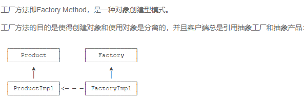


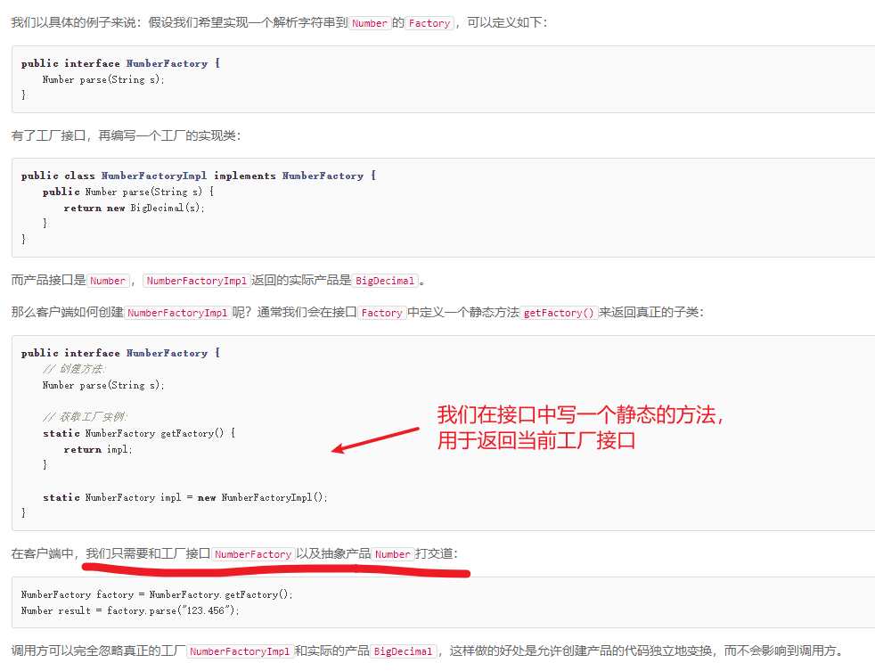

当然还有静态工厂方法

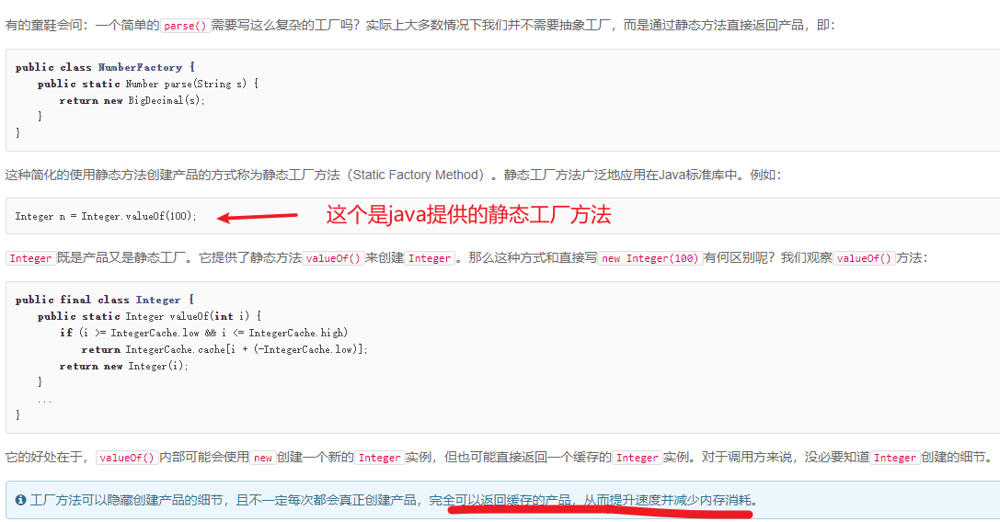


## 抽象工厂 AbstractFactory

> 提供一个创建一系列相关或相互依赖对象的接口，而无需指定它们具体的类。

抽象工厂模式（Abstract Factory）是一个比较复杂的创建型模式。

抽象工厂模式和工厂方法不太一样，它要解决的问题比较复杂，不但工厂是抽象的，产品是抽象的，而且有多个产品需要创建，因此，这个抽象工厂会对应到多个实际工厂，每个实际工厂负责创建多个实际产品：

抽象工厂模式是为了让创建工厂和一组产品与使用相分离，并可以随时切换到另一个工厂以及另一组产品；

抽象工厂模式实现的关键点是定义工厂接口和产品接口，但如何实现工厂与产品本身需要留给具体的子类实现，客户端只和抽象工厂与抽象产品打交道。

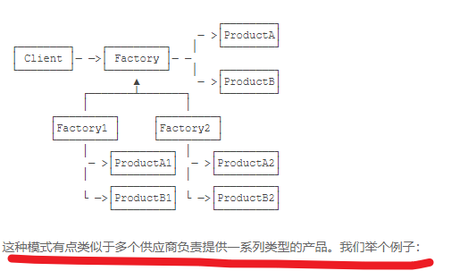


> 代码定义

首先我们定义一个抽象工厂，里面有两个实现类

```java
public interface AbstractFactory {
    // 创建Html文档:
    HtmlDocument createHtml(String md);
    // 创建Word文档:
    WordDocument createWord(String md);
}
```

然后在这个抽象工厂里面的两个方法因为实现笔记负责所以需要再定义两个接口

```java
// Html文档接口:
public interface HtmlDocument {
    String toHtml();
    void save(Path path) throws IOException;
}

// Word文档接口:
public interface WordDocument {
    void save(Path path) throws IOException;
}
```

我们有两个厂商提供服务，这个厂商只需要实现这两个接口就行了

```java
public class FastHtmlDocument implements HtmlDocument {
    public String toHtml() {
        ...
    }
    public void save(Path path) throws IOException {
        ...
    }
}

public class FastWordDocument implements WordDocument {
    public void save(Path path) throws IOException {
        ...
    }
}
```

实现接口后还需要提供一个工厂来生产产品

```java
public class FastFactory implements AbstractFactory {
    public HtmlDocument createHtml(String md) {
        return new FastHtmlDocument(md);
    }
    public WordDocument createWord(String md) {
        return new FastWordDocument(md);
    }
}
```

然后我们只需要下面这样调用就行了

```java
// 创建AbstractFactory，实际类型是FastFactory:
AbstractFactory factory = new FastFactory();
// 生成Html文档:
HtmlDocument html = factory.createHtml("#Hello\nHello, world!");
html.save(Paths.get(".", "fast.html"));
// 生成Word文档:
WordDocument word = factory.createWord("#Hello\nHello, world!");
word.save(Paths.get(".", "fast.doc"));
```

如果需要使用其他厂商提供的服务，只需要让其他厂商实现这个方法就行

如果我们要同时使用GoodDoc Soft的服务怎么办？因为用了抽象工厂模式，GoodDoc Soft只需要根据我们定义的抽象工厂和抽象产品接口，实现自己的实际工厂和实际产品即可：

```java
// 实际工厂:
public class GoodFactory implements AbstractFactory {
    public HtmlDocument createHtml(String md) {
        return new GoodHtmlDocument(md);
    }
    public WordDocument createWord(String md) {
        return new GoodWordDocument(md);
    }
}

// 实际产品:
public class GoodHtmlDocument implements HtmlDocument {
    ...
}

public class GoodWordDocument implements HtmlDocument {
    ...
}
```

当然还有下面这种进阶型用法

注意到客户端代码除了通过`new`创建了`FastFactory`或`GoodFactory`外，其余代码只引用了产品接口，并未引用任何实际产品（例如，`FastHtmlDocument`），如果把创建工厂的代码放到`AbstractFactory`中，就可以连实际工厂也屏蔽了：

```java
public interface AbstractFactory {
    public static AbstractFactory createFactory(String name) {
        if (name.equalsIgnoreCase("fast")) {
            return new FastFactory();
        } else if (name.equalsIgnoreCase("good")) {
            return new GoodFactory();
        } else {
            throw new IllegalArgumentException("Invalid factory name");
        }
    }
}
```

## 生成器 Builder

> *将一个复杂对象的构建与它的表示分离，使得同样的构建过程可以创建不同的表示*

生成器模式（Builder）是使用多个“小型”工厂来最终创建出一个完整对象。

当我们使用Builder的时候，一般来说，是因为创建这个对象的步骤比较多，每个步骤都需要一个零部件，最终组合成一个完整的对象。

我们仍然以Markdown转HTML为例，因为直接编写一个完整的转换器比较困难，但如果针对类似下面的一行文本：

很多时候，我们可以简化Builder模式，以链式调用的方式来创建对象。例如，我们经常编写这样的代码：

```java
StringBuilder builder = new StringBuilder();
builder.append(secure ? "https://" : "http://")
       .append("www.liaoxuefeng.com")
       .append("/")
       .append("?t=0");
String url = builder.toString();
```

由于我们经常需要构造URL字符串，可以使用Builder模式编写一个URLBuilder，调用方式如下：

```java
String url = URLBuilder.builder() // 创建Builder
        .setDomain("www.liaoxuefeng.com") // 设置domain
        .setScheme("https") // 设置scheme
        .setPath("/") // 设置路径
        .setQuery(Map.of("a", "123", "q", "K&R")) // 设置query
        .build(); // 完成build
```

这个东西很好理解，但是我们应该如何去实现呢？我们就拿上面那个URL Builder来作为例子，下面是实现方法：

```java
public class URLBuilder {
	private String scheme = "http";
	private int port = -1;
	private String domain = null;
	private String path = "/";
	private String username = null;
	private String password = null;
	private Map<String, String> query = null;
	public static URLBuilder builder() {
		return new URLBuilder();
	}
	public String build() {
		StringBuilder sb = new StringBuilder();
		sb.append(scheme).append("://");
		if (username != null && password != null) {
			sb.append(username).append(':').append(password).append('@');
		}
		sb.append(domain);
		if (port >= 0) {
			sb.append(':').append(port);
		}
		sb.append(path);
		if (query != null && !query.isEmpty()) {
			query.forEach((k, v) -> {
				sb.append(k).append('=').append(URLEncoder.encode(v, StandardCharsets.UTF_8));
			});
		}
		return sb.toString();
	}
	public URLBuilder setScheme(String scheme) {
		this.scheme = Objects.requireNonNull(scheme);
		return this;
	}
	public URLBuilder setDomain(String domain) {
		this.domain = Objects.requireNonNull(domain);
		return this;
	}
	public URLBuilder setPath(String path) {
		this.path = Objects.requireNonNull(path);
		return this;
	}
	public URLBuilder setQuery(Map<String, String> query) {
		this.query = query;
		return this;
	}
	public URLBuilder setPort(int port) {
		if (port < 0 || port > 65535) {
			throw new IllegalArgumentException("Invalid port");
		}
		this.port = port;
		return this;
	}
	public URLBuilder setCredential(String username, String password) {
		this.username = Objects.requireNonNull(username);
		this.password = Objects.requireNonNull(password);
		return this;
	}
}
```

## 原型 Prototype

> 用原型实例指定创建对象的种类，并且通过拷贝这些原型创建新的对象。

原型模式，即Prototype，是指创建新对象的时候，根据现有的一个原型来创建。

我们举个例子：如果我们已经有了一个`String[]`数组，想再创建一个一模一样的`String[]`数组，怎么写？

实际上创建过程很简单，就是把现有数组的元素复制到新数组。如果我们把这个创建过程封装一下，就成了原型模式。用代码实现如下：

```java
// 原型:
String[] original = { "Apple", "Pear", "Banana" };
// 新对象:
String[] copy = Arrays.copyOf(original, original.length);
```

普通类如何拷贝？

```java
public class Student implements Cloneable {
    private int id;
    private String name;
    private int score;
    // 复制新对象并返回:
    public Object clone() {
        Student std = new Student();
        std.id = this.id;
        std.name = this.name;
        std.score = this.score;
        return std;
    }
}
```

使用的时候，因为`clone()`的方法签名是定义在`Object`中，返回类型也是`Object`，所以要强制转型，比较麻烦：

```java
Student std1 = new Student();
std1.setId(123);
std1.setName("Bob");
std1.setScore(88);
// 复制新对象:
Student std2 = (Student) std1.clone();
System.out.println(std1);
System.out.println(std2);
System.out.println(std1 == std2); // false
```

实际上，使用原型模式更好的方式是定义一个`copy()`方法，返回明确的类型：

```java
public class Student {
    private int id;
    private String name;
    private int score;
    public Student copy() {
        Student std = new Student();
        std.id = this.id;
        std.name = this.name;
        std.score = this.score;
        return std;
    }
}
```

原型模式应用不是很广泛，因为很多实例会持有类似文件、Socket这样的资源，而这些资源是无法复制给另一个对象共享的，只有存储简单类型的“值”对象可以复制。

## 单例 Singleton

[单例 - 廖雪峰的官方网站 (liaoxuefeng.com)](https://www.liaoxuefeng.com/wiki/1252599548343744/1281319214514210)

> 保证一个类仅有一个实例，并提供一个访问它的全局访问点。

单例模式（Singleton）的目的是为了保证在一个进程中，某个类有且仅有一个实例。

因为这个类只有一个实例，因此，自然不能让调用方使用`new Xyz()`来创建实例了。所以，单例的构造方法必须是`private`，这样就防止了调用方自己创建实例，但是在类的内部，是可以用一个静态字段来引用唯一创建的实例的：

```java
public class Singleton {
    // 静态字段引用唯一实例:
    private static final Singleton INSTANCE = new Singleton();
    // private构造方法保证外部无法实例化:
    private Singleton() {
    }
}
```

那么问题来了，外部调用方如何获得这个唯一实例？答案是提供一个静态方法，直接返回实例：

```java
public class Singleton {
    // 静态字段引用唯一实例:
    private static final Singleton INSTANCE = new Singleton();
    // 通过静态方法返回实例:
    public static Singleton getInstance() {
        return INSTANCE;
    }
    // private构造方法保证外部无法实例化:
    private Singleton() {
    }
}
```

或者直接把`static`变量暴露给外部：

```java
public class Singleton {
    // 静态字段引用唯一实例:
    public static final Singleton INSTANCE = new Singleton();

    // private构造方法保证外部无法实例化:
    private Singleton() {
    }
}
```

所以，单例模式的实现方式很简单：

1. 只有`private`构造方法，确保外部无法实例化；
2. 通过`private static`变量持有唯一实例，保证全局唯一性；
3. 通过`public static`方法返回此唯一实例，使外部调用方能获取到实例。

Java标准库有一些类就是单例，例如`Runtime`这个类：

```java
Runtime runtime = Runtime.getRuntime();
```

那我们什么时候应该用Singleton呢？实际上，很多程序，尤其是Web程序，大部分服务类都应该被视作Singleton，如果全部按Singleton的写法写，会非常麻烦，所以，通常是通过约定让框架（例如Spring）来实例化这些类，保证只有一个实例，调用方自觉通过框架获取实例而不是`new`操作符：

```java
@Component // 表示一个单例组件
public class MyService {
    ...
}
```

因此，除非确有必要，否则Singleton模式一般以“约定”为主，不会刻意实现它。

**小结**

Singleton模式是为了保证一个程序的运行期间，某个类有且只有一个全局唯一实例；

Singleton模式既可以严格实现，也可以以约定的方式把普通类视作单例。

# 结构型模式

结构型模式主要涉及如何组合各种对象以便获得更好、更灵活的结构。虽然面向对象的继承机制提供了最基本的子类扩展父类的功能，但结构型模式不仅仅简单地使用继承，而更多地通过组合与运行期的动态组合来实现更灵活的功能。

结构型模式有：

- 适配器
- 桥接
- 组合
- 装饰器
- 外观
- 享元
- 代理

## 适配器 Adapter

> 将一个类的接口转换成客户希望的另外一个接口，使得原本由于接口不兼容而不能一起工作的那些类可以一起工作。

适配器模式是Adapter，也称Wrapper，是指如果一个接口需要B接口，但是待传入的对象却是A接口，怎么办？

我们举个例子。如果去美国，我们随身带的电器是无法直接使用的，因为美国的插座标准和中国不同，所以，我们需要一个适配器：

比如我们原本有一个Task继承的callable接口，但是Thread并不接受callable接口，那么我们应该如何让这个正常运行呢？

```java
public class Task implements Callable<Long> {
    private long num;
    public Task(long num) {
        this.num = num;
    }
    public Long call() throws Exception {
        long r = 0;
        for (long n = 1; n <= this.num; n++) {
            r = r + n;
        }
        System.out.println("Result: " + r);
        return r;
    }
}
```

我们可以使用adapter来实现

```java
public class RunnableAdapter implements Runnable {
    // 引用待转换接口:
    private Callable<?> callable;
    public RunnableAdapter(Callable<?> callable) {
        this.callable = callable;
    }
    // 实现指定接口:
    public void run() {
        // 将指定接口调用委托给转换接口调用:
        try {
            callable.call();
        } catch (Exception e) {
            throw new RuntimeException(e);
        }
    }
}
```

编写一个Adapter的步骤如下：

1. 实现目标接口，这里是`Runnable`；
2. 内部持有一个待转换接口的引用，这里是通过字段持有`Callable`接口；
3. 在目标接口的实现方法内部，调用待转换接口的方法。

这样一来，Thread就可以接收这个`RunnableAdapter`，因为它实现了`Runnable`接口。`Thread`作为调用方，它会调用`RunnableAdapter`的`run()`方法，在这个`run()`方法内部，又调用了`Callable`的`call()`方法，相当于`Thread`通过一层转换，间接调用了`Callable`的`call()`方法。

适配器模式在Java标准库中有广泛应用。比如我们持有数据类型是`String[]`，但是需要`List`接口时，可以用一个Adapter：

```java
String[] exist = new String[] {"Good", "morning", "Bob", "and", "Alice"};
Set<String> set = new HashSet<>(Arrays.asList(exist));
```

注意到`List<T> Arrays.asList(T[])`就相当于一个转换器，它可以把数组转换为`List`。

**小结**

Adapter模式可以将一个A接口转换为B接口，使得新的对象符合B接口规范。

编写Adapter实际上就是编写一个实现了B接口，并且内部持有A接口的类：

```java
public BAdapter implements B {
    private A a;
    public BAdapter(A a) {
        this.a = a;
    }
    public void b() {
        a.a();
    }
}
```

在Adapter内部将B接口的调用“转换”为对A接口的调用。

只有A、B接口均为抽象接口时，才能非常简单地实现Adapter模式。

## 桥接模式 Barage

> 将抽象部分与它的实现部分分离，使它们都可以独立地变化。

桥接模式的定义非常玄乎，直接理解不太容易，所以我们还是举例子。

假设某个汽车厂商生产三种品牌的汽车：Big、Tiny和Boss，每种品牌又可以选择燃油、纯电和混合动力。如果用传统的继承来表示各个最终车型，一共有3个抽象类加9个最终子类：

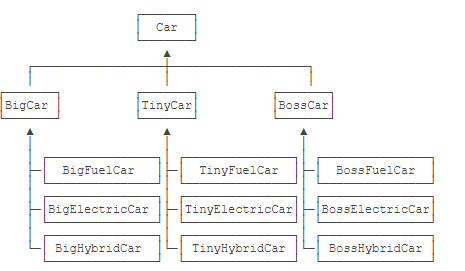

如果要新增一个品牌，或者加一个新的引擎（比如核动力），那么子类的数量增长更快。所以，桥接模式就是为了避免直接继承带来的子类爆炸。

在桥接模式中，首先把`Car`按品牌进行子类化，但是，每个品牌选择什么发动机，不再使用子类扩充，而是通过一个抽象的“修正”类，以组合的形式引入。我们来看看具体的实现。首先定义抽象类`Car`，它引用一个`Engine`：

```java
public abstract class Car {
    // 引用Engine:
    protected Engine engine;

    public Car(Engine engine) {
        this.engine = engine;
    }
    public abstract void drive();
}
```

`Engine`的定义如下：

```java
public interface Engine {
    void start();
}
```

紧接着，在一个“修正”的抽象类`RefinedCar`中定义一些额外操作：

```java
public abstract class RefinedCar extends Car {
    public RefinedCar(Engine engine) {
        super(engine);
    }

    public void drive() {
        this.engine.start();
        System.out.println("Drive " + getBrand() + " car...");
    }

    public abstract String getBrand();
}
```

这样一来，最终的不同品牌继承自`RefinedCar`，例如`BossCar`：

```java
public class BossCar extends RefinedCar {
    public BossCar(Engine engine) {
        super(engine);
    }

    public String getBrand() {
        return "Boss";
    }
}
```

而针对每一种引擎，继承自`Engine`，例如`HybridEngine`：

```java
public class HybridEngine implements Engine {
    public void start() {
        System.out.println("Start Hybrid Engine...");
    }
}
```

客户端通过自己选择一个品牌，再配合一种引擎，得到最终的Car：

```java
RefinedCar car = new BossCar(new HybridEngine());
car.drive();
```

使用桥接模式的好处在于，如果要增加一种引擎，只需要针对`Engine`派生一个新的子类，如果要增加一个品牌，只需要针对`RefinedCar`派生一个子类，任何`RefinedCar`的子类都可以和任何一种`Engine`自由组合，即一辆汽车的两个维度：品牌和引擎都可以独立地变化。

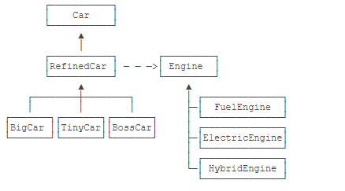

桥接模式实现比较复杂，实际应用也非常少，但它提供的设计思想值得借鉴，即不要过度使用继承，而是优先拆分某些部件，使用组合的方式来扩展功能。

## 组合  Composite

> 将对象组合成树形结构以表示“部分-整体”的层次结构，使得用户对单个对象和组合对象的使用具有一致性。

组合模式（Composite）经常用于树形结构，为了简化代码，使用Composite可以把一个叶子节点与一个父节点统一起来处理。

我们来看一个具体的例子。在XML或HTML中，从根节点开始，每个节点都可能包含任意个其他节点，这些层层嵌套的节点就构成了一颗树。

要以树的结构表示XML，我们可以先抽象出节点类型`Node`：

```java
public interface Node {
    // 添加一个节点为子节点:
    Node add(Node node);
    // 获取子节点:
    List<Node> children();
    // 输出为XML:
    String toXml();
}
```

比如我们按照这个要求定义三种节点，一个是`ElementNode`一个是`TextNode`还有一个`CommentNode`

这三种节点按照下面要求定义

```java
public class ElementNode implements Node {
    private String name;
    private List<Node> list = new ArrayList<>();
    public ElementNode(String name) {
        this.name = name;
    }
    public Node add(Node node) {
        list.add(node);
        return this;
    }
    public List<Node> children() {
        return list;
    }
    public String toXml() {
        String start = "<" + name + ">\n";
        String end = "</" + name + ">\n";
        StringJoiner sj = new StringJoiner("", start, end);
        list.forEach(node -> {
            sj.add(node.toXml() + "\n");
        });
        return sj.toString();
    }
}
```

```java
public class TextNode implements Node {
	private String text;
	public TextNode(String text) {
		this.text = text;
	}
	public Node add(Node node) {
		throw new UnsupportedOperationException();
	}
	public List<Node> children() {
		return List.of();
	}
	public String toXml() {
		return text;
	}
}
```

```java
public class CommentNode implements Node {
	private String text;
	public CommentNode(String text) {
		this.text = text;
	}
	public Node add(Node node) {
		throw new UnsupportedOperationException();
	}
	public List<Node> children() {
		return List.of();
	}
	public String toXml() {
		return "<!-- " + text + " -->";
	}
}
```

通过`ElementNode`、`TextNode`和`CommentNode`，我们就可以构造出一颗树：

```java
Node root = new ElementNode("school");
root.add(new ElementNode("classA")
        .add(new TextNode("Tom"))
        .add(new TextNode("Alice")));
root.add(new ElementNode("classB")
        .add(new TextNode("Bob"))
        .add(new TextNode("Grace"))
        .add(new CommentNode("comment...")));
System.out.println(root.toXml());
```

最后输出结果

```xml
<school>
    <classA>
        Tom
        Alice
    </classA>
    <classB>
        Bob
        Grace
    	<!-- comment... -->
    </classB>
</school>
```


**小结**

Composite模式使得叶子对象和容器对象具有一致性，从而形成统一的树形结构，并用一致的方式去处理它们。

## 装饰器 Decorator

> 动态地给一个对象添加一些额外的职责。就增加功能来说，相比生成子类更为灵活。

装饰器（Decorator）模式，是一种在运行期动态给某个对象的实例增加功能的方法。我们在IO的[Filter模式](https://www.liaoxuefeng.com/wiki/1252599548343744/1298364142452770)一节中其实已经讲过装饰器模式了。在Java标准库中，`InputStream`是抽象类，`FileInputStream`、`ServletInputStream`、`Socket.getInputStream()`这些`InputStream`都是最终数据源。

现在，如果要给不同的最终数据源增加缓冲功能、计算签名功能、加密解密功能，那么，3个最终数据源、3种功能一共需要9个子类。如果继续增加最终数据源，或者增加新功能，子类会爆炸式增长，这种设计方式显然是不可取的。Decorator模式的目的就是把一个一个的附加功能，用Decorator的方式给一层一层地累加到原始数据源上，最终，通过组合获得我们想要的功能。

```java
// 创建原始的数据源:
InputStream fis = new FileInputStream("test.gz");
// 增加缓冲功能:
InputStream bis = new BufferedInputStream(fis);
// 增加解压缩功能:
InputStream gis = new GZIPInputStream(bis);
```

或者一次性写成这样：

```java
InputStream input = new GZIPInputStream( // 第二层装饰
                        new BufferedInputStream( // 第一层装饰
                            new FileInputStream("test.gz") // 核心功能
                        ));
```

观察`BufferedInputStream`和`GZIPInputStream`，它们实际上都是从`FilterInputStream`继承的，这个`FilterInputStream`就是一个抽象的Decorator。我们用图把Decorator模式画出来如下：

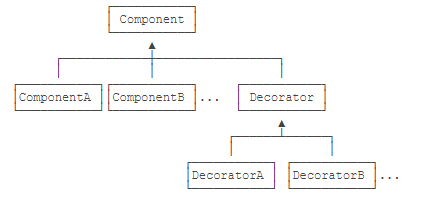

Decorator模式有什么好处？它实际上把核心功能和附加功能给分开了。核心功能指`FileInputStream`这些真正读数据的源头，附加功能指加缓冲、压缩、解密这些功能。如果我们要新增核心功能，就增加Component的子类，例如`ByteInputStream`。如果我们要增加附加功能，就增加Decorator的子类，例如`CipherInputStream`。两部分都可以独立地扩展，而具体如何附加功能，由调用方自由组合，从而极大地增强了灵活性。

> 实际例子

我们同样定义一个TextNode

```java
public interface TextNode {
    // 设置text:
    void setText(String text);
    // 获取text:
    String getText();
}
```

对于核心节点，例如`<span>`，它需要从`TextNode`直接继承：

```java
public class SpanNode implements TextNode {
    private String text;
    public void setText(String text) {
        this.text = text;
    }
    public String getText() {
        return "<span>" + text + "</span>";
    }
}
```

紧接着，为了实现Decorator模式，需要有一个抽象的Decorator类：

```java
public abstract class NodeDecorator implements TextNode {
    protected final TextNode target;
    protected NodeDecorator(TextNode target) {
        this.target = target;
    }
    public void setText(String text) {
        this.target.setText(text);
    }
}
```

这个`NodeDecorator`类的核心是持有一个`TextNode`，即将要把功能附加到的`TextNode`实例。接下来就可以写一个加粗功能：

```java
public class BoldDecorator extends NodeDecorator {
    public BoldDecorator(TextNode target) {
        super(target);
    }
    public String getText() {
        return "<b>" + target.getText() + "</b>";
    }
}
```

类似的，可以继续加`ItalicDecorator`、`UnderlineDecorator`等。客户端可以自由组合这些Decorator：

```java
TextNode n1 = new SpanNode();
TextNode n2 = new BoldDecorator(new UnderlineDecorator(new SpanNode()));
TextNode n3 = new ItalicDecorator(new BoldDecorator(new SpanNode()));
n1.setText("Hello");
n2.setText("Decorated");
n3.setText("World");
System.out.println(n1.getText());
// 输出<span>Hello</span>

System.out.println(n2.getText());
// 输出<b><u><span>Decorated</span></u></b>

System.out.println(n3.getText());
// 输出<i><b><span>World</span></b></i>
```

**小结**

使用Decorator模式，可以独立增加核心功能，也可以独立增加附加功能，二者互不影响；

可以在运行期动态地给核心功能增加任意个附加功能。

## 外观 Facade

> 为子系统中的一组接口提供一个一致的界面。Facade模式定义了一个高层接口，这个接口使得这一子系统更加容易使用。

外观模式，即Facade，是一个比较简单的模式。它的基本思想如下：

如果客户端要跟许多子系统打交道，那么客户端需要了解各个子系统的接口，比较麻烦。如果有一个统一的“中介”，让客户端只跟中介打交道，中介再去跟各个子系统打交道，对客户端来说就比较简单。所以Facade就相当于搞了一个中介。

我们以注册公司为例，假设注册公司需要三步：

1. 向工商局申请公司营业执照；
2. 在银行开设账户；
3. 在税务局开设纳税号。

以下是三个系统的接口：

```java
// 工商注册:
public class AdminOfIndustry {
    public Company register(String name) {
        ...
    }
}
// 银行开户:
public class Bank {
    public String openAccount(String companyId) {
        ...
    }
}
// 纳税登记:
public class Taxation {
    public String applyTaxCode(String companyId) {
        ...
    }
}
```

如果子系统比较复杂，并且客户对流程也不熟悉，那就把这些流程全部委托给中介：

```java
public class Facade {
    public Company openCompany(String name) {
        Company c = this.admin.register(name);
        String bankAccount = this.bank.openAccount(c.getId());
        c.setBankAccount(bankAccount);
        String taxCode = this.taxation.applyTaxCode(c.getId());
        c.setTaxCode(taxCode);
        return c;
    }
}
```

这样，客户端只跟Facade打交道，一次完成公司注册的所有繁琐流程：

```java
Company c = facade.openCompany("Facade Software Ltd.");
```

很多Web程序，内部有多个子系统提供服务，经常使用一个统一的Facade入口，例如一个`RestApiController`，使得外部用户调用的时候，只关心Facade提供的接口，不用管内部到底是哪个子系统处理的。

更复杂的Web程序，会有多个Web服务，这个时候，经常会使用一个统一的网关入口来自动转发到不同的Web服务，这种提供统一入口的网关就是Gateway，它本质上也是一个Facade，但可以附加一些用户认证、限流限速的额外服务。

**小结**

Facade模式是为了给客户端提供一个统一入口，并对外屏蔽内部子系统的调用细节。

## 享元  Flyweight

> 运用共享技术有效地支持大量细粒度的对象。

享元（Flyweight）的核心思想很简单：如果一个对象实例一经创建就不可变，那么反复创建相同的实例就没有必要，直接向调用方返回一个共享的实例就行，这样即节省内存，又可以减少创建对象的过程，提高运行速度。

享元模式在Java标准库中有很多应用。我们知道，包装类型如`Byte`、`Integer`都是不变类，因此，反复创建同一个值相同的包装类型是没有必要的。以`Integer`为例，如果我们通过`Integer.valueOf()`这个静态工厂方法创建`Integer`实例，当传入的`int`范围在`-128`~`+127`之间时，会直接返回缓存的`Integer`实例：

对于`Byte`来说，因为它一共只有256个状态，所以，通过`Byte.valueOf()`创建的`Byte`实例，全部都是缓存对象。因此，享元模式就是通过工厂方法创建对象，在工厂方法内部，很可能返回缓存的实例，而不是新创建实例，从而实现不可变实例的复用。总是使用工厂方法而不是new操作符创建实例，可获得享元模式的好处。

在实际应用中，享元模式主要应用于缓存，即客户端如果重复请求某些对象，不必每次查询数据库或者读取文件，而是直接返回内存中缓存的数据。我们以`Student`为例，设计一个静态工厂方法，它在内部可以返回缓存的对象：

```java
public class Student {
    // 持有缓存:
    private static final Map<String, Student> cache = new HashMap<>();
    // 静态工厂方法:
    public static Student create(int id, String name) {
        String key = id + "\n" + name;
        // 先查找缓存:
        Student std = cache.get(key);
        if (std == null) {
            // 未找到,创建新对象:
            System.out.println(String.format("create new Student(%s, %s)", id, name));
            std = new Student(id, name);
            // 放入缓存:
            cache.put(key, std);
        } else {
            // 缓存中存在:
            System.out.println(String.format("return cached Student(%s, %s)", std.id, std.name));
        }
        return std;
    }
    private final int id;
    private final String name;

    public Student(int id, String name) {
        this.id = id;
        this.name = name;
    }
}
```

在实际应用中，我们经常使用成熟的缓存库，例如[Guava](https://github.com/google/guava)的[Cache](https://github.com/google/guava/blob/master/guava/src/com/google/common/cache/Cache.java)，因为它提供了最大缓存数量限制、定时过期等实用功能。

**小结**

享元模式的设计思想是尽量复用已创建的对象，常用于工厂方法内部的优化。

## 代理 Proxy

> 为其他对象提供一种代理以控制对这个对象的访问。

代理模式，即Proxy，它和Adapter模式很类似。我们先回顾Adapter模式，它用于把A接口转换为B接口：

```java
public BAdapter implements B {
    private A a;
    public BAdapter(A a) {
        this.a = a;
    }
    public void b() {
        a.a();
    }
}
```

Proxy模式的代码如下

```java
public AProxy implements A {
    private A a;
    public AProxy(A a) {
        this.a = a;
    }
    public void a() {
        this.a.a();
    }
}
```

看起来好像是一样的，但是不同的地方在这里 `this.a.a();`，看起来好像啥也没干，但是我们可以在代码里面加上权限检查的功能，这样我们就实现了权限检查：

```java
public void a() {
    if (getCurrentUser().isRoot()) {
        this.a.a();
    } else {
        throw new SecurityException("Forbidden");
    }
}
```

有的童鞋会问，为啥不把权限检查的功能直接写到目标实例A的内部？

因为我们编写代码的原则有：

- 职责清晰：一个类只负责一件事；
- 易于测试：一次只测一个功能。

用Proxy实现这个权限检查，我们可以获得更清晰、更简洁的代码：

- A接口：只定义接口；
- ABusiness类：只实现A接口的业务逻辑；
- APermissionProxy类：只实现A接口的权限检查代理。

如果我们希望编写其他类型的代理，可以继续增加类似ALogProxy，而不必对现有的A接口、ABusiness类进行修改。

实际上权限检查只是代理模式的一种应用。Proxy还广泛应用在：

### 远程代理

远程代理即Remote Proxy，本地的调用者持有的接口实际上是一个代理，这个代理负责把对接口的方法访问转换成远程调用，然后返回结果。Java内置的RMI机制就是一个完整的远程代理模式。

### 虚代理

虚代理即Virtual Proxy，它让调用者先持有一个代理对象，但真正的对象尚未创建。如果没有必要，这个真正的对象是不会被创建的，直到客户端需要真的必须调用时，才创建真正的对象。JDBC的连接池返回的JDBC连接（Connection对象）就可以是一个虚代理，即获取连接时根本没有任何实际的数据库连接，直到第一次执行JDBC查询或更新操作时，才真正创建实际的JDBC连接。

### 保护代理

保护代理即Protection Proxy，它用代理对象控制对原始对象的访问，常用于鉴权。

### 智能引用

智能引用即Smart Reference，它也是一种代理对象，如果有很多客户端对它进行访问，通过内部的计数器可以在外部调用者都不使用后自动释放它。

**小结**

代理模式通过封装一个已有接口，并向调用方返回相同的接口类型，能让调用方在不改变任何代码的前提下增强某些功能（例如，鉴权、延迟加载、连接池复用等）。

使用Proxy模式要求调用方持有接口，作为Proxy的类也必须实现相同的接口类型。

# 行为型模式

行为型模式主要涉及算法和对象间的职责分配。通过使用对象组合，行为型模式可以描述一组对象应该如何协作来完成一个整体任务。

行为型模式有：

- 责任链
- 命令
- 解释器
- 迭代器
- 中介
- 备忘录
- 观察者
- 状态
- 策略
- 模板方法
- 访问者

## 责任链 Chain of Responsibility

> 使多个对象都有机会处理请求，从而避免请求的发送者和接收者之间的耦合关系。将这些对象连成一条链，并沿着这条链传递该请求，直到有一个对象处理它为止。

责任链模式（Chain of Responsibility）是一种处理请求的模式，它让多个处理器都有机会处理该请求，直到其中某个处理成功为止。责任链模式把多个处理器串成链，然后让请求在链上传递：

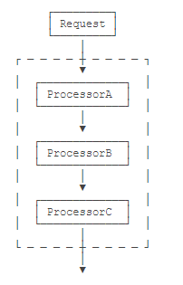

在实际场景中，财务审批就是一个责任链模式。假设某个员工需要报销一笔费用，审核者可以分为：

- Manager：只能审核1000元以下的报销；
- Director：只能审核10000元以下的报销；
- CEO：可以审核任意额度。

用责任链模式设计此报销流程时，每个审核者只关心自己责任范围内的请求，并且处理它。对于超出自己责任范围的，扔给下一个审核者处理，这样，将来继续添加审核者的时候，不用改动现有逻辑。我们来看看如何实现责任链模式。

我们创建一个请求，这个请求用于在责任链中进行传递

```java
public class Request {
    private String name;
    private BigDecimal amount;

    public Request(String name, BigDecimal amount) {
        this.name = name;
        this.amount = amount;
    }

    public String getName() {
        return name;
    }

    public BigDecimal getAmount() {
        return amount;
    }
}
```

我们需要抽象出一个处理器来处理请求

```java
public interface Handler {
    // 返回Boolean.TRUE = 成功
    // 返回Boolean.FALSE = 拒绝
    // 返回null = 交下一个处理
	Boolean process(Request request);
}
```

并且做好约定：如果返回`Boolean.TRUE`，表示处理成功，如果返回`Boolean.FALSE`，表示处理失败（请求被拒绝），如果返回`null`，则交由下一个`Handler`处理。

然后，依次编写ManagerHandler、DirectorHandler和CEOHandler。以ManagerHandler为例：

```java
public class ManagerHandler implements Handler {
    public Boolean process(Request request) {
        // 如果超过1000元，处理不了，交下一个处理:
        if (request.getAmount().compareTo(BigDecimal.valueOf(1000)) > 0) {
            return null;
        }
        // 对Bob有偏见:（这里判断名字，如果名字为Bob那么就拒绝处理）
        return !request.getName().equalsIgnoreCase("bob");
    }
}
```

了不同的`Handler`后，我们还要把这些`Handler`组合起来，变成一个链，并通过一个统一入口处理：

```java
public class HandlerChain {
    // 持有所有Handler:
    private List<Handler> handlers = new ArrayList<>();
	// 添加handler来进行处理
    public void addHandler(Handler handler) {
        this.handlers.add(handler);
    }
	// 处理请求
    public boolean process(Request request) {
        // 依次调用每个Handler:
        for (Handler handler : handlers) {
            Boolean r = handler.process(request);
            if (r != null) {
                // 如果返回TRUE或FALSE，处理结束:
                System.out.println(request + " " + (r ? "Approved by " : "Denied by ") + handler.getClass().getSimpleName());
                return r;
            }
        }
        throw new RuntimeException("Could not handle request: " + request);
    }
}
```

现在，我们就可以在客户端组装出责任链，然后用责任链来处理请求：

```java
// 构造责任链:（这里我们给责任链加上这三个角色来处理请求）
HandlerChain chain = new HandlerChain();
chain.addHandler(new ManagerHandler());
chain.addHandler(new DirectorHandler());
chain.addHandler(new CEOHandler());
// 处理请求:
chain.process(new Request("Bob", new BigDecimal("123.45")));
chain.process(new Request("Alice", new BigDecimal("1234.56")));
chain.process(new Request("Bill", new BigDecimal("12345.67")));
chain.process(new Request("John", new BigDecimal("123456.78")));
```

责任链模式本身很容易理解，需要注意的是，`Handler`添加的顺序很重要，如果顺序不对，处理的结果可能就不是符合要求的。

此外，责任链模式有很多变种。有些责任链的实现方式是通过某个`Handler`手动调用下一个`Handler`来传递`Request`，例如：

```java
public class AHandler implements Handler {
    private Handler next;
    public void process(Request request) {
        if (!canProcess(request)) {
            // 手动交给下一个Handler处理:
            next.process(request);
        } else {
            ...
        }
    }
}
```

还有一些责任链模式，每个`Handler`都有机会处理`Request`，通常这种责任链被称为拦截器（Interceptor）或者过滤器（Filter），它的目的不是找到某个`Handler`处理掉`Request`，而是每个`Handler`都做一些工作，比如：

- 记录日志；
- 检查权限；
- 准备相关资源；
- ...

例如，JavaEE的Servlet规范定义的`Filter`就是一种责任链模式，它不但允许每个`Filter`都有机会处理请求，还允许每个`Filter`决定是否将请求“放行”给下一个`Filter`：

```java
public class AuditFilter implements Filter {
    public void doFilter(ServletRequest req, ServletResponse resp, FilterChain chain) throws IOException, ServletException {
        log(req);
        if (check(req)) {
            // 放行:
            chain.doFilter(req, resp);
        } else {
            // 拒绝:
            sendError(resp);
        }
    }
}
```

这种模式不但允许一个`Filter`自行决定处理`ServletRequest`和`ServletResponse`，还可以“伪造”`ServletRequest`和`ServletResponse`以便让下一个`Filter`处理，能实现非常复杂的功能。

**小结**

责任链模式是一种把多个处理器组合在一起，依次处理请求的模式；

责任链模式的好处是添加新的处理器或者重新排列处理器非常容易；

责任链模式经常用在拦截、预处理请求等。

## 命令 Command

> 将一个请求封装为一个对象，从而使你可用不同的请求对客户进行参数化，对请求排队或记录请求日志，以及支持可撤销的操作。

命令模式（Command）是指，把请求封装成一个命令，然后执行该命令。

在使用命令模式前，我们先以一个编辑器为例子，看看如何实现简单的编辑操作：

```java
public class TextEditor {
    private StringBuilder buffer = new StringBuilder();
    public void copy() {
        ...
    }
    public void paste() {
        String text = getFromClipBoard();
        add(text);
    }
    public void add(String s) {
        buffer.append(s);
    }
    public void delete() {
        if (buffer.length() > 0) {
            buffer.deleteCharAt(buffer.length() - 1);
        }
    }
    public String getState() {
        return buffer.toString();
    }
}
```

我们用一个`StringBuilder`模拟一个文本编辑器，它支持`copy()`、`paste()`、`add()`、`delete()`等方法。

正常情况，我们像这样调用`TextEditor`：

```java
TextEditor editor = new TextEditor();
editor.add("Command pattern in text editor.\n");
editor.copy();
editor.paste();
System.out.println(editor.getState());
```

这是直接调用方法，调用方需要了解`TextEditor`的所有接口信息。如果改用命令模式，我们就要把调用方发送命令和执行方执行命令分开。怎么分？

解决方案是引入一个`Command`接口：

```java
public interface Command {
    void execute();
}
```

调用方创建一个对应的`Command`，然后执行，并不关心内部是如何具体执行的。为了支持`CopyCommand`和`PasteCommand`这两个命令，我们从`Command`接口派生：

```java
public class CopyCommand implements Command {
    // 持有执行者对象:
    private TextEditor receiver;

    public CopyCommand(TextEditor receiver) {
        this.receiver = receiver;
    }

    public void execute() {
        // 相当于我们自己写一个专门的接口去执行editor这个对象的copy方法
        receiver.copy();
    }
}

public class PasteCommand implements Command {
    private TextEditor receiver;
    public PasteCommand(TextEditor receiver) {
        this.receiver = receiver;
    }
    public void execute() {
        receiver.paste();
    }
}
```

最后我们把`Command`和`TextEditor`组装一下，客户端这么写：（这个和之前手动实现的代码是一样的）

```java
TextEditor editor = new TextEditor();
editor.add("Command pattern in text editor.\n");
// 执行一个CopyCommand:
Command copy = new CopyCommand(editor);
copy.execute();
editor.add("----\n");
// 执行一个PasteCommand:
Command paste = new PasteCommand(editor);
paste.execute();
System.out.println(editor.getState());
```

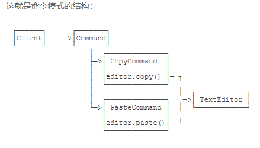

有的童鞋会有疑问：搞了一大堆`Command`，多了好几个类，还不如直接这么写简单：

```java
TextEditor editor = new TextEditor();
editor.add("Command pattern in text editor.\n");
editor.copy();
editor.paste();
```

实际上，使用命令模式，确实增加了系统的复杂度。如果需求很简单，那么直接调用显然更直观而且更简单。

那么我们还需要命令模式吗？

答案是视需求而定。如果`TextEditor`复杂到一定程度，并且需要支持Undo、Redo的功能时，就需要使用命令模式，因为我们可以给每个命令增加`undo()`：

```java
public interface Command {
    void execute();
    void undo();
}
```

后把执行的一系列命令用`List`保存起来，就既能支持Undo，又能支持Redo。这个时候，我们又需要一个`Invoker`对象，负责执行命令并保存历史命令：

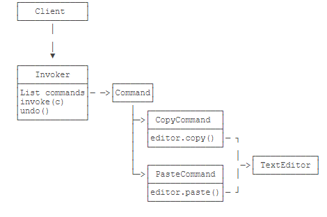

可见，模式带来的设计复杂度的增加是随着需求而增加的，它减少的是系统各组件的耦合度。

**小结**

命令模式的设计思想是把命令的创建和执行分离，使得调用者无需关心具体的执行过程。

通过封装`Command`对象，命令模式可以保存已执行的命令，从而支持撤销、重做等操作。

## 解释器 Interpreter

> 给定一个语言，定义它的文法的一种表示，并定义一个解释器，这个解释器使用该表示来解释语言中的句子。

解释器模式（Interpreter）是一种针对特定问题设计的一种解决方案。例如，匹配字符串的时候，由于匹配条件非常灵活，使得通过代码来实现非常不灵活。举个例子，针对以下的匹配条件：

- 以`+`开头的数字表示的区号和电话号码，如`+861012345678`；
- 以英文开头，后接英文和数字，并以.分隔的域名，如`www.liaoxuefeng.com`；
- 以`/`开头的文件路径，如`/path/to/file.txt`；
- ...

因此，需要一种通用的表示方法——正则表达式来进行匹配。正则表达式就是一个字符串，但要把正则表达式解析为语法树，然后再匹配指定的字符串，就需要一个解释器。

实现一个完整的正则表达式的解释器非常复杂，但是使用解释器模式却很简单：

```java
String s = "+861012345678";
System.out.println(s.matches("^\\+\\d+$"));
```

类似的，当我们使用JDBC时，执行的SQL语句虽然是字符串，但最终需要数据库服务器的SQL解释器来把SQL“翻译”成数据库服务器能执行的代码，这个执行引擎也非常复杂，但对于使用者来说，仅仅需要写出SQL字符串即可。

**小结**

解释器模式通过抽象语法树实现对用户输入的解释执行。

解释器模式的实现通常非常复杂，且一般只能解决一类特定问题。

## 迭代器  Iterator

> 提供一种方法顺序访问一个聚合对象中的各个元素，而又不需要暴露该对象的内部表示。

迭代器模式（Iterator）实际上在Java的集合类中已经广泛使用了。我们以`List`为例，要遍历`ArrayList`，即使我们知道它的内部存储了一个`Object[]`数组，也不应该直接使用数组索引去遍历，因为这样需要了解集合内部的存储结构。如果使用`Iterator`遍历，那么，`ArrayList`和`LinkedList`都可以以一种统一的接口来遍历：

```java
List<String> list = ...
for (Iterator<String> it = list.iterator(); it.hasNext(); ) {
    String s = it.next();
}
```

实际上，因为Iterator模式十分有用，因此，Java允许我们直接把任何支持`Iterator`的集合对象用`foreach`循环写出来：

```java
List<String> list = ...
for (String s : list) {

}
```

然后由Java编译器完成Iterator模式的所有循环代码。

虽然我们对如何使用Iterator有了一定了解，但如何实现一个Iterator模式呢？我们以一个自定义的集合为例，通过Iterator模式实现倒序遍历：

```java
public class ReverseArrayCollection<T> implements Iterable<T> {
    // 以数组形式持有集合:
    private T[] array;

    public ReverseArrayCollection(T... objs) {
        this.array = Arrays.copyOfRange(objs, 0, objs.length);
    }

    public Iterator<T> iterator() {
        return ???;
    }
}
```

实现Iterator模式的关键是返回一个`Iterator`对象，该对象知道集合的内部结构，因为它可以实现倒序遍历。我们使用Java的内部类实现这个`Iterator`：

```java
public class ReverseArrayCollection<T> implements Iterable<T> {
    private T[] array;

    public ReverseArrayCollection(T... objs) {
        this.array = Arrays.copyOfRange(objs, 0, objs.length);
    }

    public Iterator<T> iterator() {
        return new ReverseIterator();
    }

    class ReverseIterator implements Iterator<T> {
        // 索引位置:
        int index;

        public ReverseIterator() {
            // 创建Iterator时,索引在数组末尾:
            this.index = ReverseArrayCollection.this.array.length;
        }

        public boolean hasNext() {
            // 如果索引大于0,那么可以移动到下一个元素(倒序往前移动):
            return index > 0;
        }

        public T next() {
            // 将索引移动到下一个元素并返回(倒序往前移动):
            index--;
            return array[index];
        }
    }
}
```

使用内部类的好处是内部类隐含地持有一个它所在对象的`this`引用，可以通过`ReverseArrayCollection.this`引用到它所在的集合。上述代码实现的逻辑非常简单，但是实际应用时，如果考虑到多线程访问，当一个线程正在迭代某个集合，而另一个线程修改了集合的内容时，是否能继续安全地迭代，还是抛出`ConcurrentModificationException`，就需要更仔细地设计。

**小结**

Iterator模式常用于遍历集合，它允许集合提供一个统一的`Iterator`接口来遍历元素，同时保证调用者对集合内部的数据结构一无所知，从而使得调用者总是以相同的接口遍历各种不同类型的集合。

## 中介 Mediator

> 用一个中介对象来封装一系列的对象交互。中介者使各个对象不需要显式地相互引用，从而使其耦合松散，而且可以独立地改变它们之间的交互。

中介模式（Mediator）又称调停者模式，它的目的是把多方会谈变成双方会谈，从而实现多方的松耦合。

有些童鞋听到中介立刻想到房产中介，立刻气不打一处来。这个中介模式与房产中介还真有点像，所以消消气，先看例子。

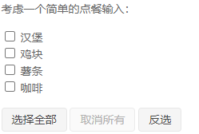

这个小系统有4个参与对象：

- 多选框；
- “选择全部”按钮；
- “取消所有”按钮；
- “反选”按钮。

它的复杂性在于，当多选框变化时，它会影响“选择全部”和“取消所有”按钮的状态（是否可点击），当用户点击某个按钮时，例如“反选”，除了会影响多选框的状态，它又可能影响“选择全部”和“取消所有”按钮的状态。

所以这是一个多方会谈，逻辑写起来很复杂：

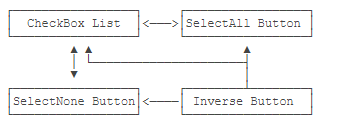

如果我们引入一个中介，把多方会谈变成多个双方会谈，虽然多了一个对象，但对象之间的关系就变简单了：

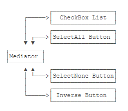

下面我们用中介模式来实现各个UI组件的交互。首先把UI组件给画出来：

```java
public class Main {
    public static void main(String[] args) {
        new OrderFrame("Hanburger", "Nugget", "Chip", "Coffee");
    }
}

class OrderFrame extends JFrame {
    public OrderFrame(String... names) {
        setTitle("Order");
        setSize(460, 200);
        setDefaultCloseOperation(JFrame.EXIT_ON_CLOSE);
        Container c = getContentPane();
        c.setLayout(new FlowLayout(FlowLayout.LEADING, 20, 20));
        c.add(new JLabel("Use Mediator Pattern"));
        List<JCheckBox> checkboxList = addCheckBox(names);
        JButton selectAll = addButton("Select All");
        JButton selectNone = addButton("Select None");
        selectNone.setEnabled(false);
        JButton selectInverse = addButton("Inverse Select");
        new Mediator(checkBoxList, selectAll, selectNone, selectInverse);
        setVisible(true);
    }

    private List<JCheckBox> addCheckBox(String... names) {
        JPanel panel = new JPanel();
        panel.add(new JLabel("Menu:"));
        List<JCheckBox> list = new ArrayList<>();
        for (String name : names) {
            JCheckBox checkbox = new JCheckBox(name);
            list.add(checkbox);
            panel.add(checkbox);
        }
        getContentPane().add(panel);
        return list;
    }

    private JButton addButton(String label) {
        JButton button = new JButton(label);
        getContentPane().add(button);
        return button;
    }
}
```

我们写一个类来实现这些逻辑

```java
public class Mediator {
    // 引用UI组件:
    private List<JCheckBox> checkBoxList;
    private JButton selectAll;
    private JButton selectNone;
    private JButton selectInverse;

    public Mediator(List<JCheckBox> checkBoxList, JButton selectAll, JButton selectNone, JButton selectInverse) {
        this.checkBoxList = checkBoxList;
        this.selectAll = selectAll;
        this.selectNone = selectNone;
        this.selectInverse = selectInverse;
        // 绑定事件:
        this.checkBoxList.forEach(checkBox -> {
            checkBox.addChangeListener(this::onCheckBoxChanged);
        });
        this.selectAll.addActionListener(this::onSelectAllClicked);
        this.selectNone.addActionListener(this::onSelectNoneClicked);
        this.selectInverse.addActionListener(this::onSelectInverseClicked);
    }

    // 当checkbox有变化时:
    public void onCheckBoxChanged(ChangeEvent event) {
        boolean allChecked = true;
        boolean allUnchecked = true;
        for (var checkBox : checkBoxList) {
            if (checkBox.isSelected()) {
                allUnchecked = false;
            } else {
                allChecked = false;
            }
        }
        selectAll.setEnabled(!allChecked);
        selectNone.setEnabled(!allUnchecked);
    }

    // 当点击select all:
    public void onSelectAllClicked(ActionEvent event) {
        checkBoxList.forEach(checkBox -> checkBox.setSelected(true));
        selectAll.setEnabled(false);
        selectNone.setEnabled(true);
    }

    // 当点击select none:
    public void onSelectNoneClicked(ActionEvent event) {
        checkBoxList.forEach(checkBox -> checkBox.setSelected(false));
        selectAll.setEnabled(true);
        selectNone.setEnabled(false);
    }

    // 当点击select inverse:
    public void onSelectInverseClicked(ActionEvent event) {
        checkBoxList.forEach(checkBox -> checkBox.setSelected(!checkBox.isSelected()));
        onCheckBoxChanged(null);
    }
}
```

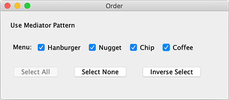

使用Mediator模式后，我们得到了以下好处：

- 各个UI组件互不引用，这样就减少了组件之间的耦合关系；
- Mediator用于当一个组件发生状态变化时，根据当前所有组件的状态决定更新某些组件；
- 如果新增一个UI组件，我们只需要修改Mediator更新状态的逻辑，现有的其他UI组件代码不变。

Mediator模式经常用在有众多交互组件的UI上。为了简化UI程序，MVC模式以及MVVM模式都可以看作是Mediator模式的扩展。

**小结**

中介模式是通过引入一个中介对象，把多边关系变成多个双边关系，从而简化系统组件的交互耦合度。

## 备忘录 Memento

> 在不破坏封装性的前提下，捕获一个对象的内部状态，并在该对象之外保存这个状态。

备忘录模式（Memento），主要用于捕获一个对象的内部状态，以便在将来的某个时候恢复此状态。

其实我们使用的几乎所有软件都用到了备忘录模式。最简单的备忘录模式就是保存到文件，打开文件。对于文本编辑器来说，保存就是把`TextEditor`类的字符串存储到文件，打开就是恢复`TextEditor`类的状态。对于图像编辑器来说，原理是一样的，只是保存和恢复的数据格式比较复杂而已。Java的序列化也可以看作是备忘录模式。

在使用文本编辑器的时候，我们还经常使用Undo、Redo这些功能。这些其实也可以用备忘录模式实现，即不定期地把`TextEditor`类的字符串复制一份存起来，这样就可以Undo或Redo。

我们以一个文本编辑器`TextEditor`为例，它内部使用`StringBuilder`允许用户增删字符：

```java
public class TextEditor {
    private StringBuilder buffer = new StringBuilder();

    public void add(char ch) {
        buffer.append(ch);
    }

    public void add(String s) {
        buffer.append(s);
    }

    public void delete() {
        if (buffer.length() > 0) {
            buffer.deleteCharAt(buffer.length() - 1);
        }
    }
}
```

为了支持这个`TextEditor`能保存和恢复状态，我们增加`getState()`和`setState()`两个方法：

```java
public class TextEditor {
    ...

    // 获取状态:
    public String getState() {
        return buffer.toString();
    }

    // 恢复状态:
    public void setState(String state) {
        this.buffer.delete(0, this.buffer.length());
        this.buffer.append(state);
    }
}
```

对这个简单的文本编辑器，用一个`String`就可以表示其状态，对于复杂的对象模型，通常我们会使用JSON、XML等复杂格式。

**小结**

备忘录模式是为了保存对象的内部状态，并在将来恢复，大多数软件提供的保存、打开，以及编辑过程中的Undo、Redo都是备忘录模式的应用。

## 观察者 Observer

> 定义对象间的一种一对多的依赖关系，当一个对象的状态发生改变时，所有依赖于它的对象都得到通知并被自动更新。

观察者模式（Observer）又称发布-订阅模式（Publish-Subscribe：Pub/Sub）。它是一种通知机制，让发送通知的一方（被观察方）和接收通知的一方（观察者）能彼此分离，互不影响。

要理解观察者模式，我们还是看例子。

假设一个电商网站，有多种`Product`（商品），同时，`Customer`（消费者）和`Admin`（管理员）对商品上架、价格改变都感兴趣，希望能第一时间获得通知。于是，`Store`（商场）可以这么写：

```java
public class Store {
    Customer customer;
    Admin admin;

    private Map<String, Product> products = new HashMap<>();

    public void addNewProduct(String name, double price) {
        Product p = new Product(name, price);
        products.put(p.getName(), p);
        // 通知用户:
        customer.onPublished(p);
        // 通知管理员:
        admin.onPublished(p);
    }

    public void setProductPrice(String name, double price) {
        Product p = products.get(name);
        p.setPrice(price);
        // 通知用户:
        customer.onPriceChanged(p);
        // 通知管理员:
        admin.onPriceChanged(p);
    }
}
```

我们观察上述`Store`类的问题：它直接引用了`Customer`和`Admin`。先不考虑多个`Customer`或多个`Admin`的问题，上述`Store`类最大的问题是，如果要加一个新的观察者类型，例如工商局管理员，`Store`类就必须继续改动。

因此，上述问题的本质是`Store`希望发送通知给那些关心`Product`的对象，但`Store`并不想知道这些人是谁。观察者模式就是要分离被观察者和观察者之间的耦合关系。

要实现这一目标也很简单，`Store`不能直接引用`Customer`和`Admin`，相反，它引用一个`ProductObserver`接口，任何人想要观察`Store`，只要实现该接口，并且把自己注册到`Store`即可：

```java
public class Store {
    private List<ProductObserver> observers = new ArrayList<>();
    private Map<String, Product> products = new HashMap<>();

    // 注册观察者:
    public void addObserver(ProductObserver observer) {
        this.observers.add(observer);
    }

    // 取消注册:
    public void removeObserver(ProductObserver observer) {
        this.observers.remove(observer);
    }

    public void addNewProduct(String name, double price) {
        Product p = new Product(name, price);
        products.put(p.getName(), p);
        // 通知观察者:
        observers.forEach(o -> o.onPublished(p));
    }

    public void setProductPrice(String name, double price) {
        Product p = products.get(name);
        p.setPrice(price);
        // 通知观察者:
        observers.forEach(o -> o.onPriceChanged(p));
    }
}
```

就是这么一个小小的改动，使得观察者类型就可以无限扩充，而且，观察者的定义可以放到客户端：

```java
// observer:
Admin a = new Admin();
Customer c = new Customer();
// store:
Store store = new Store();
// 注册观察者:
store.addObserver(a);
store.addObserver(c);
```

甚至可以注册匿名观察者：

```java
store.addObserver(new ProductObserver() {
    public void onPublished(Product product) {
        System.out.println("[Log] on product published: " + product);
    }

    public void onPriceChanged(Product product) {
        System.out.println("[Log] on product price changed: " + product);
    }
});
```

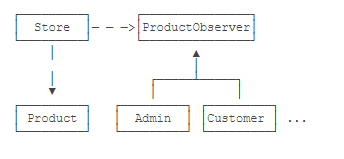

观察者模式也有很多变体形式。有的观察者模式把被观察者也抽象出接口：

```java
public interface ProductObservable { // 注意此处拼写是Observable不是Observer!
    void addObserver(ProductObserver observer);
    void removeObserver(ProductObserver observer);
}
```

对应的实体被观察者就要实现该接口：

```java
public class Store implements ProductObservable {
    ...
}
```

有些观察者模式把通知变成一个Event对象，从而不再有多种方法通知，而是统一成一种：

```java
public interface ProductObserver {
    void onEvent(ProductEvent event);
}
```

让观察者自己从Event对象中读取通知类型和通知数据。

广义的观察者模式包括所有消息系统。所谓消息系统，就是把观察者和被观察者完全分离，通过消息系统本身来通知：

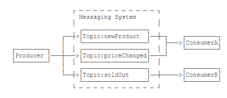

消息发送方称为Producer，消息接收方称为Consumer，Producer发送消息的时候，必须选择发送到哪个Topic。Consumer可以订阅自己感兴趣的Topic，从而只获得特定类型的消息。

使用消息系统实现观察者模式时，Producer和Consumer甚至经常不在同一台机器上，并且双方对对方完全一无所知，因为注册观察者这个动作本身都在消息系统中完成，而不是在Producer内部完成。

此外，注意到我们在编写观察者模式的时候，通知Observer是依靠语句：

```java
observers.forEach(o -> o.onPublished(p));
```

这说明各个观察者是依次获得的同步通知，如果上一个观察者处理太慢，会导致下一个观察者不能及时获得通知。此外，如果观察者在处理通知的时候，发生了异常，还需要被观察者处理异常，才能保证继续通知下一个观察者。

思考：如何改成异步通知，使得所有观察者可以并发同时处理？

有的童鞋可能发现Java标准库有个`java.util.Observable`类和一个`Observer`接口，用来帮助我们实现观察者模式。但是，这个类非常不！好！用！实现观察者模式的时候，也不推荐借助这两个东东。

**小结**

观察者模式，又称发布-订阅模式，是一种一对多的通知机制，使得双方无需关心对方，只关心通知本身。

## 状态 State

> 允许一个对象在其内部状态改变时改变它的行为。对象看起来似乎修改了它的类。

状态模式（State）经常用在带有状态的对象中。

什么是状态？我们以QQ聊天为例，一个用户的QQ有几种状态：

- 离线状态（尚未登录）；
- 正在登录状态；
- 在线状态；
- 忙状态（暂时离开）。

如何表示状态？我们定义一个`enum`就可以表示不同的状态。但不同的状态需要对应不同的行为，比如收到消息时：

```java
if (state == ONLINE) {
    // 闪烁图标
} else if (state == BUSY) {
    reply("现在忙，稍后回复");
} else if ...
```

状态模式的目的是为了把上述一大串`if...else...`的逻辑给分拆到不同的状态类中，使得将来增加状态比较容易。

例如，我们设计一个聊天机器人，它有两个状态：

- 未连线；
- 已连线。

对于未连线状态，我们收到消息也不回复：

```java
public class DisconnectedState implements State {
    public String init() {
        return "Bye!";
    }

    public String reply(String input) {
        return "";
    }
}
```

对于已连线状态，我们回应收到的消息：

```java
public class ConnectedState implements State {
    public String init() {
        return "Hello, I'm Bob.";
    }
    public String reply(String input) {
        if (input.endsWith("?")) {
            return "Yes. " + input.substring(0, input.length() - 1) + "!";
        }
        if (input.endsWith(".")) {
            return input.substring(0, input.length() - 1) + "!";
        }
        return input.substring(0, input.length() - 1) + "?";
    }
}
```

状态模式的关键设计思想在于状态切换，我们引入一个`BotContext`完成状态切换：

```java
public class BotContext {
	private State state = new DisconnectedState();

	public String chat(String input) {
		if ("hello".equalsIgnoreCase(input)) {
            // 收到hello切换到在线状态:
			state = new ConnectedState();
			return state.init();
		} else if ("bye".equalsIgnoreCase(input)) {
            /  收到bye切换到离线状态:
			state = new DisconnectedState();
			return state.init();
		}
		return state.reply(input);
	}
}
```

这样，一个价值千万的AI聊天机器人就诞生了：

```java
Scanner scanner = new Scanner(System.in);
BotContext bot = new BotContext();
for (;;) {
    System.out.print("> ");
    String input = scanner.nextLine();
    String output = bot.chat(input);
    System.out.println(output.isEmpty() ? "(no reply)" : "< " + output);
}
```

试试效果：

```shell
> hello
< Hello, I'm Bob.
> Nice to meet you.
< Nice to meet you!
> Today is cold?
< Yes. Today is cold!
> bye
< Bye!
```

**小结**

状态模式的设计思想是把不同状态的逻辑分离到不同的状态类中，从而使得增加新状态更容易；

状态模式的实现关键在于状态转换。简单的状态转换可以直接由调用方指定，复杂的状态转换可以在内部根据条件触发完成。

## 策略 Strategy

> 定义一系列的算法，把它们一个个封装起来，并且使它们可相互替换。本模式使得算法可独立于使用它的客户而变化。

策略模式：Strategy，是指，定义一组算法，并把其封装到一个对象中。然后在运行时，可以灵活的使用其中的一个算法。

策略模式在Java标准库中应用非常广泛，我们以排序为例，看看如何通过`Arrays.sort()`实现忽略大小写排序：

```java
public class Main {
    public static void main(String[] args) throws InterruptedException {
        String[] array = { "apple", "Pear", "Banana", "orange" };
        Arrays.sort(array, String::compareToIgnoreCase);
        System.out.println(Arrays.toString(array));
    }
}

```

如果我们想忽略大小写排序，就传入`String::compareToIgnoreCase`，如果我们想倒序排序，就传入`(s1, s2) -> -s1.compareTo(s2)`，这个比较两个元素大小的算法就是策略。

我们观察`Arrays.sort(T[] a, Comparator<? super T> c)`这个排序方法，它在内部实现了TimSort排序，但是，排序算法在比较两个元素大小的时候，需要借助我们传入的`Comparator`对象，才能完成比较。因此，这里的策略是指比较两个元素大小的策略，可以是忽略大小写比较，可以是倒序比较，也可以根据字符串长度比较。

因此，上述排序使用到了策略模式，它实际上指，在一个方法中，流程是确定的，但是，某些关键步骤的算法依赖调用方传入的策略，这样，传入不同的策略，即可获得不同的结果，大大增强了系统的灵活性。

如果我们自己实现策略模式的排序，用冒泡法编写如下：

```java
public class Main {
    public static void main(String[] args) throws InterruptedException {
        String[] array = { "apple", "Pear", "Banana", "orange" };
        sort(array, String::compareToIgnoreCase);
        System.out.println(Arrays.toString(array));
    }
    static <T> void sort(T[] a, Comparator<? super T> c) {
        for (int i = 0; i < a.length - 1; i++) {
            for (int j = 0; j < a.length - 1 - i; j++) {
                if (c.compare(a[j], a[j + 1]) > 0) { // 注意这里比较两个元素的大小依赖传入的策略
                    T temp = a[j];
                    a[j] = a[j + 1];
                    a[j + 1] = temp;
                }
            }
        }
    }
}

```

> 实战

一个完整的策略模式要定义策略以及使用策略的上下文。我们以购物车结算为例，假设网站针对普通会员、Prime会员有不同的折扣，同时活动期间还有一个满100减20的活动，这些就可以作为策略实现。先定义打折策略接口：

```java
public interface DiscountStrategy {
    // 计算折扣额度:
    BigDecimal getDiscount(BigDecimal total);
}
```

接下来，就是实现各种策略。普通用户策略如下：

```java
public class UserDiscountStrategy implements DiscountStrategy {
    public BigDecimal getDiscount(BigDecimal total) {
        // 普通会员打九折:
        return total.multiply(new BigDecimal("0.1")).setScale(2, RoundingMode.DOWN);
    }
}
```

满减策略如下：

```java
public class OverDiscountStrategy implements DiscountStrategy {
    public BigDecimal getDiscount(BigDecimal total) {
        // 满100减20优惠:
        return total.compareTo(BigDecimal.valueOf(100)) >= 0 ? BigDecimal.valueOf(20) : BigDecimal.ZERO;
    }
}
```

最后，要应用策略，我们需要一个`DiscountContext`：

```java
public class DiscountContext {
    // 持有某个策略:
    private DiscountStrategy strategy = new UserDiscountStrategy();

    // 允许客户端设置新策略:
    public void setStrategy(DiscountStrategy strategy) {
        this.strategy = strategy;
    }

    public BigDecimal calculatePrice(BigDecimal total) {
        return total.subtract(this.strategy.getDiscount(total)).setScale(2);
    }
}
```

调用方必须首先创建一个DiscountContext，并指定一个策略（或者使用默认策略），即可获得折扣后的价格：

```java
DiscountContext ctx = new DiscountContext();

// 默认使用普通会员折扣:
BigDecimal pay1 = ctx.calculatePrice(BigDecimal.valueOf(105));
System.out.println(pay1);

// 使用满减折扣:
ctx.setStrategy(new OverDiscountStrategy());
BigDecimal pay2 = ctx.calculatePrice(BigDecimal.valueOf(105));
System.out.println(pay2);

// 使用Prime会员折扣:
ctx.setStrategy(new PrimeDiscountStrategy());
BigDecimal pay3 = ctx.calculatePrice(BigDecimal.valueOf(105));
System.out.println(pay3);
```

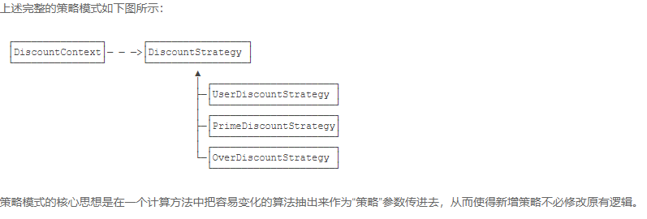

**小结**

策略模式是为了允许调用方选择一个算法，从而通过不同策略实现不同的计算结果。

通过扩展策略，不必修改主逻辑，即可获得新策略的结果。

## 模板方法  Template Method

> 定义一个操作中的算法的骨架，而将一些步骤延迟到子类中，使得子类可以不改变一个算法的结构即可重定义该算法的某些特定步骤。

模板方法（Template Method）是一个比较简单的模式。它的主要思想是，定义一个操作的一系列步骤，对于某些暂时确定不下来的步骤，就留给子类去实现好了，这样不同的子类就可以定义出不同的步骤。

因此，模板方法的核心在于定义一个“骨架”。我们还是举例说明。

假设我们开发了一个从数据库读取设置的类：

```java
public class Setting {
    public final String getSetting(String key) {
        String value = readFromDatabase(key);
        return value;
    }

	private String readFromDatabase(String key) {
        // TODO: 从数据库读取
    }
}
```

由于从数据库读取数据较慢，我们可以考虑把读取的设置缓存起来，这样下一次读取同样的key就不必再访问数据库了。但是怎么实现缓存，暂时没想好，但不妨碍我们先写出使用缓存的代码：

```java
public class Setting {
    public final String getSetting(String key) {
        // 先从缓存读取:
        String value = lookupCache(key);
        if (value == null) {
            // 在缓存中未找到,从数据库读取:
            value = readFromDatabase(key);
            System.out.println("[DEBUG] load from db: " + key + " = " + value);
            // 放入缓存:
            putIntoCache(key, value);
        } else {
            System.out.println("[DEBUG] load from cache: " + key + " = " + value);
        }
        return value;
    }
```

整个流程没有问题，但是，`lookupCache(key)`和`putIntoCache(key, value)`这两个方法还根本没实现，怎么编译通过？这个不要紧，我们声明抽象方法就可以：

```java
public abstract class AbstractSetting {
    public final String getSetting(String key) {
        String value = lookupCache(key);
        if (value == null) {
            value = readFromDatabase(key);
            putIntoCache(key, value);
        }
        return value;
    }

    protected abstract String lookupCache(String key);

    protected abstract void putIntoCache(String key, String value);
}
```

因为声明了抽象方法，自然整个类也必须是抽象类。如何实现`lookupCache(key)`和`putIntoCache(key, value)`这两个方法就交给子类了。子类其实并不关心核心代码`getSetting(key)`的逻辑，它只需要关心如何完成两个小小的子任务就可以了。

假设我们希望用一个`Map`做缓存，那么可以写一个`LocalSetting`：

```java
public class LocalSetting extends AbstractSetting {
    private Map<String, String> cache = new HashMap<>();

    protected String lookupCache(String key) {
        return cache.get(key);
    }

    protected void putIntoCache(String key, String value) {
        cache.put(key, value);
    }
}
```

如果我们要使用Redis做缓存，那么可以再写一个`RedisSetting`：

```java
public class RedisSetting extends AbstractSetting {
    private RedisClient client = RedisClient.create("redis://localhost:6379");

    protected String lookupCache(String key) {
        try (StatefulRedisConnection<String, String> connection = client.connect()) {
            RedisCommands<String, String> commands = connection.sync();
            return commands.get(key);
        }
    }

    protected void putIntoCache(String key, String value) {
        try (StatefulRedisConnection<String, String> connection = client.connect()) {
            RedisCommands<String, String> commands = connection.sync();
            commands.set(key, value);
        }
    }
}
```

客户端代码使用本地缓存的代码这么写：

```java
AbstractSetting setting1 = new LocalSetting();
System.out.println("test = " + setting1.getSetting("test"));
System.out.println("test = " + setting1.getSetting("test"));
```

要改成Redis缓存，只需要把`LocalSetting`替换为`RedisSetting`：

```java
AbstractSetting setting2 = new RedisSetting();
System.out.println("autosave = " + setting2.getSetting("autosave"));
System.out.println("autosave = " + setting2.getSetting("autosave"));
```

可见，模板方法的核心思想是：父类定义骨架，子类实现某些细节。

为了防止子类重写父类的骨架方法，可以在父类中对骨架方法使用`final`。对于需要子类实现的抽象方法，一般声明为`protected`，使得这些方法对外部客户端不可见。

Java标准库也有很多模板方法的应用。在集合类中，`AbstractList`和`AbstractQueuedSynchronizer`都定义了很多通用操作，子类只需要实现某些必要方法。

**小结**

模板方法是一种高层定义骨架，底层实现细节的设计模式，适用于流程固定，但某些步骤不确定或可替换的情况。

## 访问者 Visitor

> 表示一个作用于某对象结构中的各元素的操作。它使你可以在不改变各元素的类的前提下定义作用于这些元素的新操作。

访问者模式（Visitor）是一种操作一组对象的操作，它的目的是不改变对象的定义，但允许新增不同的访问者，来定义新的操作。

访问者模式的设计比较复杂，如果我们查看GoF原始的访问者模式，它是这么设计的：

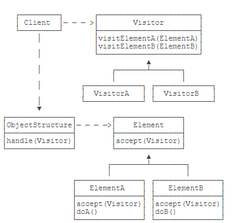

上述模式的复杂之处在于上述访问者模式为了实现所谓的“双重分派”，设计了一个回调再回调的机制。因为Java只支持基于多态的单分派模式，这里强行模拟出“双重分派”反而加大了代码的复杂性。

这里我们只介绍简化的访问者模式。假设我们要递归遍历某个文件夹的所有子文件夹和文件，然后找出`.java`文件，正常的做法是写个递归：

```java
void scan(File dir, List<File> collector) {
    for (File file : dir.listFiles()) {
        if (file.isFile() && file.getName().endsWith(".java")) {
            collector.add(file);
        } else if (file.isDir()) {
            // 递归调用:
            scan(file, collector);
        }
    }
}
```

上述代码的问题在于，扫描目录的逻辑和处理.java文件的逻辑混在了一起。如果下次需要增加一个清理`.class`文件的功能，就必须再重复写扫描逻辑。

因此，访问者模式先把数据结构（这里是文件夹和文件构成的树型结构）和对其的操作（查找文件）分离开，以后如果要新增操作（例如清理`.class`文件），只需要新增访问者，不需要改变现有逻辑。

用访问者模式改写上述代码步骤如下：

首先，我们需要定义访问者接口，即该访问者能够干的事情：

```java
public interface Visitor {
    // 访问文件夹:
    void visitDir(File dir);
    // 访问文件:
    void visitFile(File file);
}
```

紧接着，我们要定义能持有文件夹和文件的数据结构`FileStructure`

```java
public class FileStructure {
    // 根目录:
    private File path;
    public FileStructure(File path) {
        this.path = path;
    }
}
```

然后，我们给`FileStructure`增加一个`handle()`方法，传入一个访问者：

```java
public class FileStructure {
    ...
    public void handle(Visitor visitor) {
		scan(this.path, visitor);
	}
	private void scan(File file, Visitor visitor) {
		if (file.isDirectory()) {
            // 让访问者处理文件夹:
			visitor.visitDir(file);
			for (File sub : file.listFiles()) {
                // 递归处理子文件夹:
				scan(sub, visitor);
			}
		} else if (file.isFile()) {
            // 让访问者处理文件:
			visitor.visitFile(file);
		}
	}
}
```

这样，我们就把访问者的行为抽象出来了。如果我们要实现一种操作，例如，查找`.java`文件，就传入`JavaFileVisitor`

```java
FileStructure fs = new FileStructure(new File("."));
fs.handle(new JavaFileVisitor())
```

这个`JavaFileVisitor`实现如下：

```java
public class JavaFileVisitor implements Visitor {
    public void visitDir(File dir) {
        System.out.println("Visit dir: " + dir);
    }

    public void visitFile(File file) {
        if (file.getName().endsWith(".java")) {
            System.out.println("Found java file: " + file);
        }
    }
}
```

类似的，如果要清理`.class`文件，可以再写一个`ClassFileClearnerVisitor`：

```java
public class ClassFileCleanerVisitor implements Visitor {
	public void visitDir(File dir) {
	}
	public void visitFile(File file) {
		if (file.getName().endsWith(".class")) {
			System.out.println("Will clean class file: " + file);
		}
	}
}
```

可见，访问者模式的核心思想是为了访问比较复杂的数据结构，不去改变数据结构，而是把对数据的操作抽象出来，在“访问”的过程中以回调形式在访问者中处理操作逻辑。如果要新增一组操作，那么只需要增加一个新的访问者。

`Files.walkFileTree()`允许访问者返回`FileVisitResult.CONTINUE`以便继续访问，或者返回`FileVisitResult.TERMINATE`停止访问。

类似的，对XML的SAX处理也是一个访问者模式，我们需要提供一个SAX Handler作为访问者处理XML的各个节点。

**小结**

访问者模式是为了抽象出作用于一组复杂对象的操作，并且后续可以新增操作而不必对现有的对象结构做任何改动。

