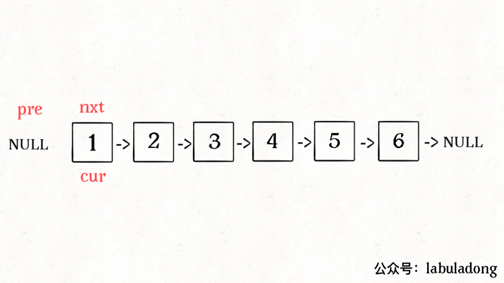

参考 [递归反转链表的一部分 - labuladong的算法小抄 (gitbook.io)](https://labuladong.gitbook.io/algo/shu-ju-jie-gou-xi-lie/shou-ba-shou-shua-lian-biao-ti-mu-xun-lian-di-gui-si-wei/di-gui-fan-zhuan-lian-biao-de-yi-bu-fen#er-fan-zhuan-lian-biao-qian-n-ge-jie-dian)

# 反转整个链表

链表定义

```java
// 单链表节点的结构
public class ListNode {
    int val;
    ListNode next;
    ListNode(int x) { val = x; }
}
```


我们的测试函数如下

```java
    static ListNode reverse(ListNode head) {
        if (head.next == null) {
            return head;
        }
        ListNode last = reverse(head.next);
        head.next.next = head;
        head.next = null;
        return last;
    }


    public static void main(String[] args) {
       ListNode listNode1 = new ListNode(1);
       ListNode listNode2 = new ListNode(2);
       ListNode listNode3 = new ListNode(3);
       ListNode listNode4 = new ListNode(4);
       listNode1.next = listNode2;
       listNode2.next = listNode3;
       listNode3.next = listNode4;
       ListNode result=reverse(listNode1);
       System.out.println(result);
    }
```


debug的结果如下


详细解释可以看参考的那个链接，很简洁明了

# 反转前N个链表


```java
    private static ListNode successor = null;


    // 反转以 head 为起点的 n 个节点，返回新的头结点
    static ListNode reverseN(ListNode head, int n) {
        if (n == 1) {
            // 记录第 n + 1 个节点
            successor = head.next;
            return head;
        }
        // 以 head.next 为起点，需要反转前 n - 1 个节点（这里我们通过n-1来判断当前节点）
        ListNode last = reverseN(head.next, n - 1);

        head.next.next = head;
        // 让反转之后的 head 节点和后面的节点连起来
        head.next = successor;
        return last;
    }

    public static void main(String[] args) {
       ListNode listNode1 = new ListNode(1);
       ListNode listNode2 = new ListNode(2);
       ListNode listNode3 = new ListNode(3);
       ListNode listNode4 = new ListNode(4);
       ListNode listNode5 = new ListNode(5);
       listNode1.next = listNode2;
       listNode2.next = listNode3;
       listNode3.next = listNode4;
       listNode4.next = listNode5;
       ListNode result=reverseN(listNode1,3);
       System.out.println(result);
    }
```

这个算法和前面算法区别在于，这个算法加了一个后驱节点


这个理解可以看代码注释

# 反转链表的一部分

```java
private static ListNode successor = null;


// 反转以 head 为起点的 n 个节点，返回新的头结点
static ListNode reverseN(ListNode head, int n) {
    if (n == 1) {
        // 记录第 n + 1 个节点
        successor = head.next;
        return head;
    }
    // 以 head.next 为起点，需要反转前 n - 1 个节点
    ListNode last = reverseN(head.next, n - 1);

    head.next.next = head;
    // 让反转之后的 head 节点和后面的节点连起来
    head.next = successor;
    return last;
}

static ListNode reverseBetween(ListNode head, int m, int n) {
    // base case
    if (m == 1) {
        return reverseN(head, n);
    }
    // 前进到反转的起点触发 base case
    head.next = reverseBetween(head.next, m - 1, n - 1);
    return head;
}

public static void main(String[] args) {
   ListNode listNode1 = new ListNode(1);
   ListNode listNode2 = new ListNode(2);
   ListNode listNode3 = new ListNode(3);
   ListNode listNode4 = new ListNode(4);
   ListNode listNode5 = new ListNode(5);
   listNode1.next = listNode2;
   listNode2.next = listNode3;
   listNode3.next = listNode4;
   listNode4.next = listNode5;
   ListNode result=reverseBetween(listNode1,2,3);
   System.out.println(result);
}
```

debug结果


这个其实就是我们先利用递归到达前面的第n个值，那个n-1是因为我们那个n是相对值


# 如何K个一组来反转链表

参考[如何k个一组反转链表 - labuladong的算法小抄 (gitbook.io)](https://labuladong.gitbook.io/algo/shu-ju-jie-gou-xi-lie/shou-ba-shou-shua-lian-biao-ti-mu-xun-lian-di-gui-si-wei/k-ge-yi-zu-fan-zhuan-lian-biao)


在反转之前，我们先来看一下如何使用迭代算法来反转以A为节点的链表

```java
// 反转以 a 为头结点的链表
static ListNode reverse(ListNode a) {
    // 定义前驱，当前节点，后继节点
    ListNode pre, cur, nxt;
    // 当前节点为a，下一个节点也是a
    pre = null; cur = a; nxt = a;
    // 当当前节点为空的时候跳出循环
    while (cur != null) {
        // 下一个节点就是当前节点的下一个节点
        nxt = cur.next;
        // 逐个结点反转（当前节点下一个节点为前一个节点，这里其实就反转了）
        cur.next = pre;
        // 更新指针位置（前驱改为当前节点，当前节点跳到下一个节点）
        pre = cur;
        cur = nxt;
    }
    // 返回反转后的头结点
    return pre;
}


public static void main(String[] args) {
   ListNode listNode1 = new ListNode(1);
   ListNode listNode2 = new ListNode(2);
   ListNode listNode3 = new ListNode(3);
   ListNode listNode4 = new ListNode(4);
   ListNode listNode5 = new ListNode(5);
   listNode1.next = listNode2;
   listNode2.next = listNode3;
   listNode3.next = listNode4;
   listNode4.next = listNode5;
   ListNode result=reverse(listNode1);
   System.out.println(result);
}
```


debug效果


动画效果如下



如果我们想反转a-b之间的节点呢，其实我们只需要修改一下终止条件就可以了

```java
/** 反转区间 [a, b) 的元素，注意是左闭右开 */
static ListNode reverse(ListNode a, ListNode b) {
    ListNode pre, cur, nxt;
    pre = null; cur = a; nxt = a;
    // while 终止的条件改一下就行了
    while (cur != b) {
        nxt = cur.next;
        cur.next = pre;
        pre = cur;
        cur = nxt;
    }
    // 返回反转后的头结点
    return pre;
}


public static void main(String[] args) {
   ListNode listNode1 = new ListNode(1);
   ListNode listNode2 = new ListNode(2);
   ListNode listNode3 = new ListNode(3);
   ListNode listNode4 = new ListNode(4);
   ListNode listNode5 = new ListNode(5);
   listNode1.next = listNode2;
   listNode2.next = listNode3;
   listNode3.next = listNode4;
   listNode4.next = listNode5;
   ListNode result=reverse(listNode2,listNode4);
   System.out.println(result);
}
```


有了上面这个迭代的方式，我们就可以得出下面的结论

```java
blic class Main {

    /** 反转区间 [a, b) 的元素，注意是左闭右开 */
    static ListNode reverse(ListNode a, ListNode b) {
        ListNode pre, cur, nxt;
        pre = null; cur = a; nxt = a;
        // while 终止的条件改一下就行了
        while (cur != b) {
            nxt = cur.next;
            cur.next = pre;
            pre = cur;
            cur = nxt;
        }
        // 返回反转后的头结点
        return pre;
    }

    /** 反转区间 [a, b) 的元素，注意是左闭右开 */
    static ListNode reverseKGroup(ListNode head, int k) {
        if (head == null) {return null;}
        // 区间 [a, b) 包含 k 个待反转元素
        ListNode a, b;
        a = b = head;
        for (int i = 0; i < k; i++) {
            // 不足 k 个，不需要反转，base case
            if (b == null) {return head;}
            b = b.next;
        }
        // 反转前 k 个元素
        ListNode newHead = reverse(a, b);
        // 递归反转后续链表并连接起来
        a.next = reverseKGroup(b, k);
        return newHead;
    }


    public static void main(String[] args) {
       ListNode listNode1 = new ListNode(1);
       ListNode listNode2 = new ListNode(2);
       ListNode listNode3 = new ListNode(3);
       ListNode listNode4 = new ListNode(4);
       ListNode listNode5 = new ListNode(5);
       listNode1.next = listNode2;
       listNode2.next = listNode3;
       listNode3.next = listNode4;
       listNode4.next = listNode5;
       ListNode result=reverseKGroup(listNode1,2);
       System.out.println(result);
    }
```


# 回文链表

如何使用递归来完成链表的前序遍历和后序遍历

```java
// 前序遍历代码
static void traverseHead(ListNode head) {
    if(head==null){
        return;
    }
    // 前序遍历代码
    System.out.println(head.val);
    traverseHead(head.next);
}

// 后序遍历代码
static void traverseBack(ListNode head) {
    if(head==null){
        return;
    }
    traverseBack(head.next);
    // 后序遍历代码
    System.out.println(head.val);
}

public static void main(String[] args) {
   ListNode listNode1 = new ListNode(1);
   ListNode listNode2 = new ListNode(2);
   ListNode listNode3 = new ListNode(3);
   ListNode listNode4 = new ListNode(4);
   ListNode listNode5 = new ListNode(5);
   listNode1.next = listNode2;
   listNode2.next = listNode3;
   listNode3.next = listNode4;
   listNode4.next = listNode5;
   System.out.println("前序遍历");
   traverseHead(listNode1);
   System.out.println("后序遍历");
   traverseBack(listNode1);
}
```

打印结果

```
前序遍历
1
2
3
4
5
后序遍历
5
4
3
2
1
```

如何使用双指针判断回文串


```java
// 左侧指针
ListNode left;

boolean isPalindrome(ListNode head) {
    left = head;
    return traverse(head);
}

boolean traverse(ListNode right) {
    if (right == null) return true;
    boolean res = traverse(right.next);
    // 后序遍历代码
    res = res && (right.val == left.val);
    left = left.next;
    return res;
}
```

这里我们其实利用了递归的栈来解决问题，首先递归到最底层，然后我们在通过left指针来存储最左边的数据，这样我们的最左边和最右边就可以进行比较了，这个栈会不断回退，我们的指针会不断前进，知道全部为true就说明这个程序是回文串


当然我们可以优化一下我们的空间复杂度


大致思路：利用两个指针，一个快指针，一个慢指针，这个快指针会指向最后一个节点，然后我们反转链表进行比较


