## ARP协议和ARP攻击

ARP协议是地址解析协议。ARP攻击的第一步就是ARP欺骗。由上述“ARP协议的工作过程”我们知道，ARP协议基本没有对网络的安全性做任何思考，当时人们考虑的重点是如何保证网络通信能够正确和快速的完成——ARP协议工作的前提是默认了其所在的网络是一个善良的网络，每台主机在向网络中发送应答信号时都是使用的真实身份。不过后来，人们发现ARP应答中的IP地址和MAC地址中的信息是可以伪造的，并不一定是自己的真实IP地址和MAC地址，由此，ARP欺骗就产生了。

## ICMP协议

ICMP（Internet Control Message Protocol）Internet控制[报文](https://baike.baidu.com/item/报文/3164352)协议。它是[TCP/IP协议簇](https://baike.baidu.com/item/TCP%2FIP协议簇)的一个子协议，用于在IP[主机](https://baike.baidu.com/item/主机/455151)、[路由](https://baike.baidu.com/item/路由)器之间传递控制消息。控制消息是指[网络通](https://baike.baidu.com/item/网络通)不通、[主机](https://baike.baidu.com/item/主机/455151)是否可达、[路由](https://baike.baidu.com/item/路由/363497)是否可用等网络本身的消息。这些控制消息虽然并不传输用户数据，但是对于用户数据的传递起着重要的作用

## 路由器和交换机的区别

1.工作层次不同：交换机比[路由器](https://www.baidu.com/s?wd=路由器&tn=SE_PcZhidaonwhc_ngpagmjz&rsv_dl=gh_pc_zhidao)更简单，[路由器](https://www.baidu.com/s?wd=路由器&tn=SE_PcZhidaonwhc_ngpagmjz&rsv_dl=gh_pc_zhidao)比交换器能获取更多信息

2.交换机工作在数据链路层，而路由器工作在网络层

3.数据转发所依据的对象不同

4.交换机的数据转发依据是利用物理地址或者说MAC地址来确定转发数据的目的地址而路由器是依据ip地址进行工作的

5.传统的交换机只能分割冲突域，不能分割广播域;而路由器可以分割广播域

## IP地址的分类

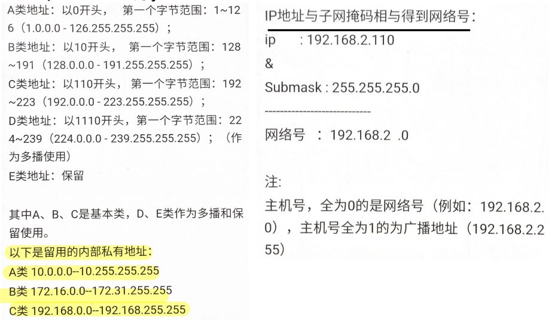

## 什么是ARP协议

**ARP协议完成了IP地址与物理地址的映射**。每一个主机都设有一个 ARP 高速缓存，里面有**所在的局域网**上的各主机和路由器的 IP 地址到硬件地址的映射表。当源主机要发送数据包到目的主机时，会先检查自己的ARP高速缓存中有没有目的主机的MAC地址，如果有，就直接将数据包发到这个MAC地址，如果没有，就向**所在的局域网**发起一个ARP请求的广播包（在发送自己的 ARP 请求时，同时会带上自己的 IP 地址到硬件地址的映射），收到请求的主机检查自己的IP地址和目的主机的IP地址是否一致，如果一致，则先保存源主机的映射到自己的ARP缓存，然后给源主机发送一个ARP响应数据包。源主机收到响应数据包之后，先添加目的主机的IP地址与MAC地址的映射，再进行数据传送。如果源主机一直没有收到响应，表示ARP查询失败。

如果所要找的主机和源主机不在同一个局域网上，那么就要通过 ARP 找到一个位于本局域网上的某个路由器的硬件地址，然后把分组发送给这个路由器，让这个路由器把分组转发给下一个网络。剩下的工作就由下一个网络来做。

## 什么是NAT(Network Address Translation, 网络地址转换)？

用于解决内网中的主机要和因特网上的主机通信。由NAT路由器将主机的本地IP地址转换为全球IP地址，分为静态转换（转换得到的全球IP地址固定不变）和动态NAT转换。

## 网络层提供的两种服务

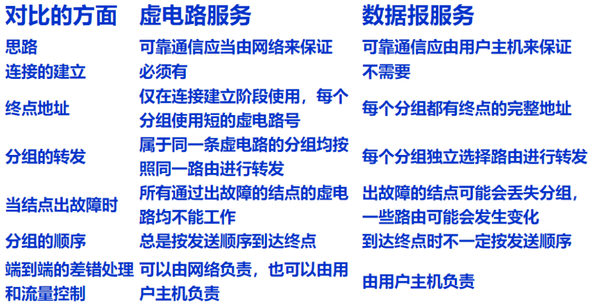

# IP协议

分类IP地址（ABCDE类）D类用于IP多播

Ip数据报的最大长度为64k

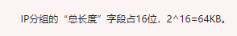

## IP地址首部校验和计算

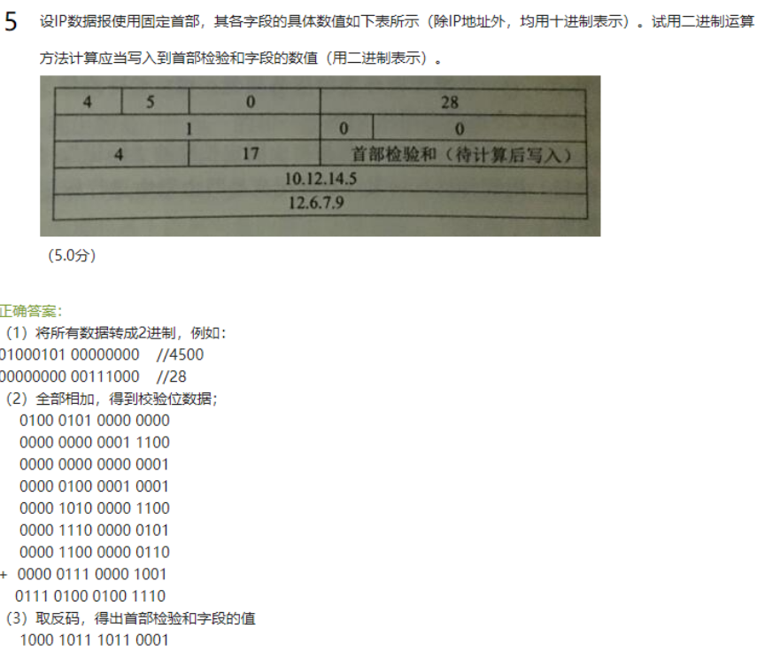

## IP数据报偏移字段

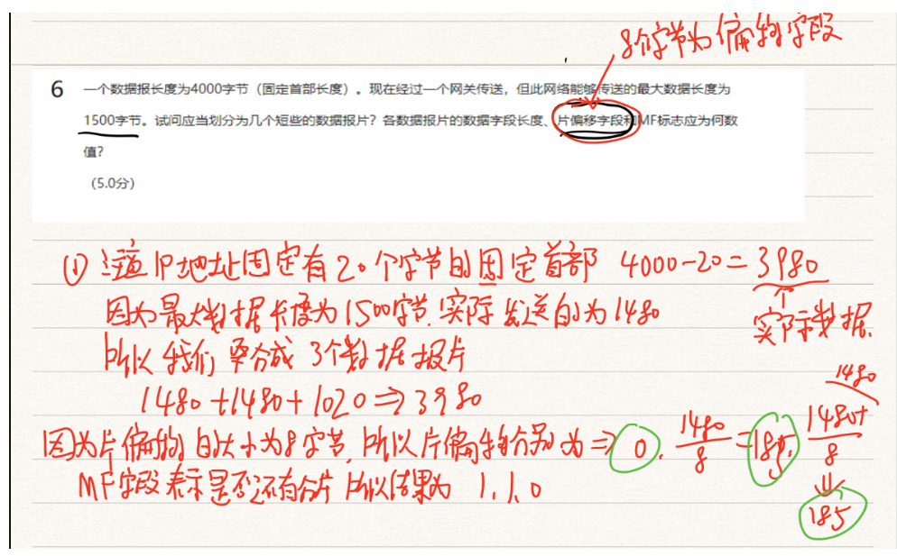

> 校验字段仅校验IP分组首部

## IP网段分组

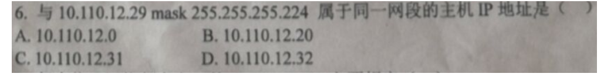

29可以看成 0001 1101 然后这个255.255.255.224其实就是前24+3 = 27位都是1，然后我们依次计算这些ip地址

10.110.12.0=》00000000 这个全为0 代表所有主机不能使用

10.110.12.20=》0001 0100 这个前三位和题目的一样，可以使用答案就是这个

10.110.12.31=》0001 1111 这个看似可以但是因为这个子网其实全为1，这个是广播地址同样不能使用

10.110.12.32=》0010 0000  这个前三位就和题目不一样，所以这个不能使用

## ARP协议

地址解析协议，即ARP（Address Resolution Protocol），是根据[IP地址](https://baike.baidu.com/item/IP地址)获取[物理地址](https://baike.baidu.com/item/物理地址/2129)的一个[TCP/IP协议](https://baike.baidu.com/item/TCP%2FIP协议)。[主机](https://baike.baidu.com/item/主机/455151)发送信息时将包含目标IP地址的ARP请求广播到局域网络上的所有主机，并接收返回消息，以此确定目标的物理地址；收到返回消息后将该IP地址和物理地址存入本机ARP缓存中并保留一定时间，下次请求时直接查询ARP缓存以节约资源。地址解析协议是建立在网络中各个主机互相信任的基础上的，局域网络上的主机可以自主发送ARP应答消息，其他主机收到应答报文时不会检测该报文的真实性就会将其记入本机ARP缓存；由此攻击者就可以向某一主机发送伪ARP应答报文，使其发送的信息无法到达预期的主机或到达错误的主机，这就构成了一个[ARP欺骗](https://baike.baidu.com/item/ARP欺骗)。[ARP命令](https://baike.baidu.com/item/ARP命令)可用于查询本机ARP缓存中IP地址和[MAC地址](https://baike.baidu.com/item/MAC地址)的对应关系、添加或删除静态对应关系等。相关协议有[RARP](https://baike.baidu.com/item/RARP)、[代理ARP](https://baike.baidu.com/item/代理ARP)。[NDP](https://baike.baidu.com/item/NDP)用于在[IPv6](https://baike.baidu.com/item/IPv6)中代替地址解析协议。

# 划分子网和构造超网

## CIDR（无分类编制）意义 

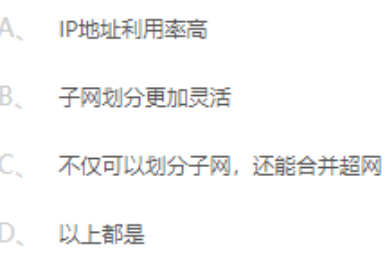

## CIDR地址聚合

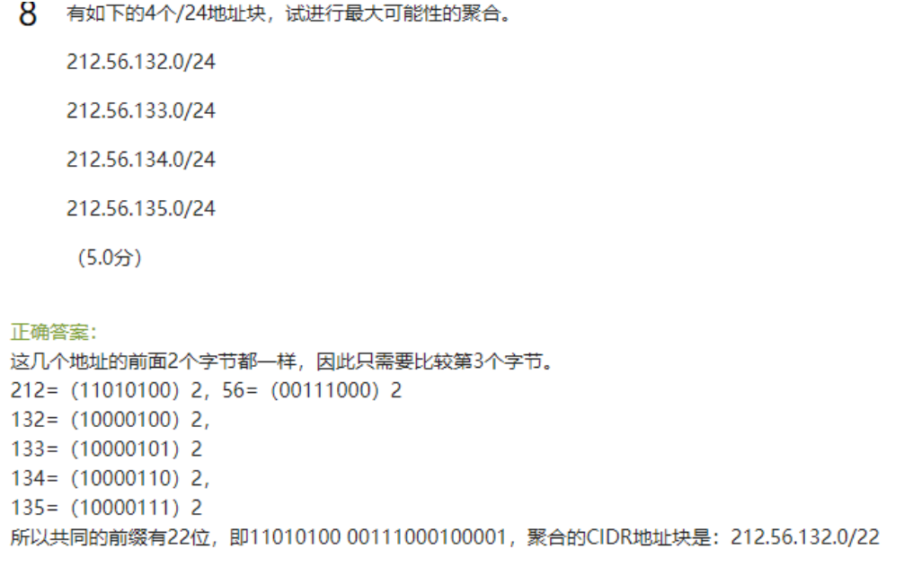

## 求最小和最大地址

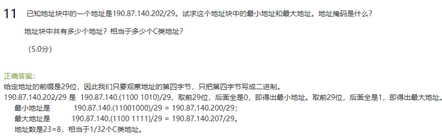

地址掩码为255.255.255.248

# 地址设计方案

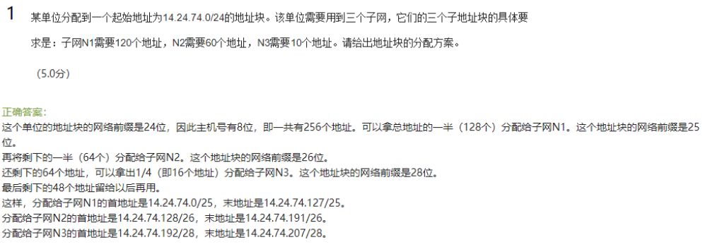

# 其他协议

## ICMP协议

ICMP是报文控制协议，有ICMP差错报文和ICMP询问报文这两种

## RIP协议（重点）

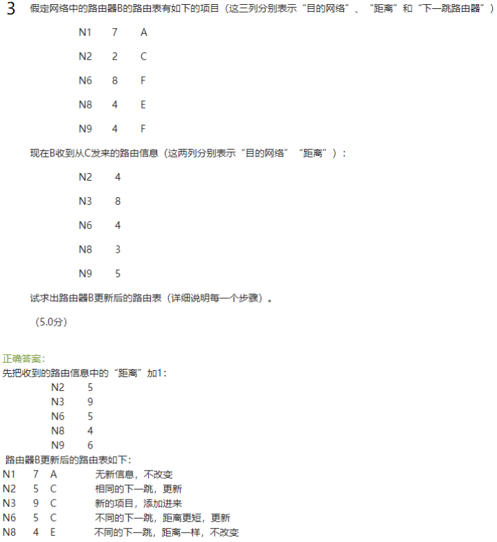

# 路由相关

这个就是路由表的选择协议

路由表中“0.0.0.0/0”代表默认路由

## 路由查找算法

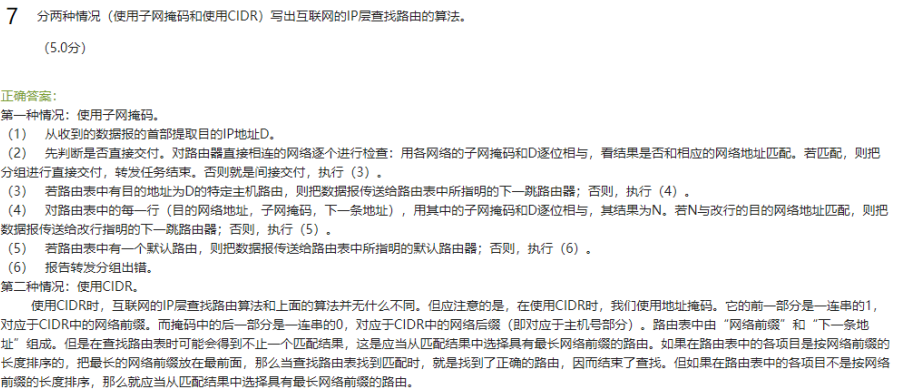

## 地址匹配

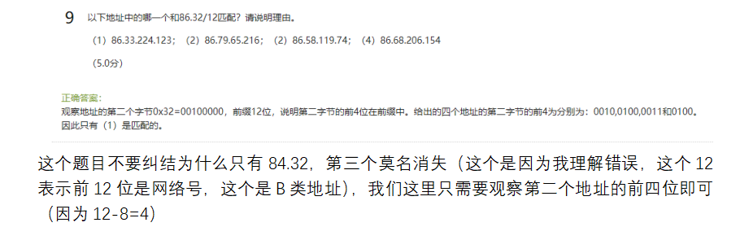

## 路由局域网专用地址

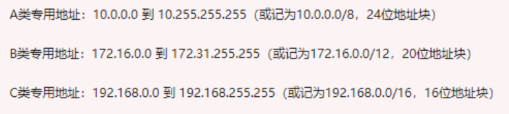

## 子网掩码

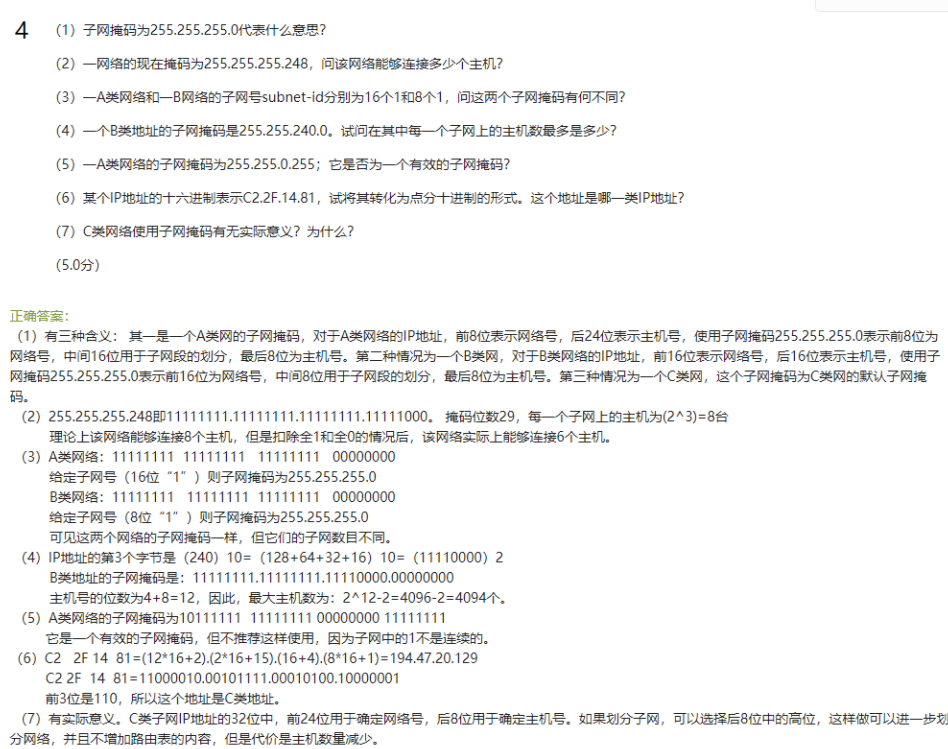

注意：1.子网掩码要记得扣除全0和全1的情况

2.子网掩码虽然可以使用诸如255.255.0.255的情况，但是实际情况下不推荐，因为1不是连续的

3.ABC类的ip地址可以根据前3位来判断

4.C类地址的子网掩码同样可以进行划分子网

# IP地址和硬件地址

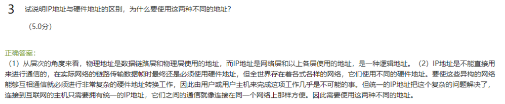

